# AI Notes

- importance: high
  reason: This note contains critical information about AI concepts.
Tags:
- AI
- Machine Learning
- Notes

## 1. Weights and Biases

Weights and biases are fundamental components of artificial neural networks, which are widely used in machine learning and deep learning. They play a crucial role in determining how the network processes input data and makes predictions.

https://www.youtube.com/watch?v=nEt5_8V_wpY

### Weights
Weights refer to the parameters within a neural network that are learned during training. They determine the strength of the connections between neurons in different layers. Adjusting these weights through backpropagation helps the model learn from the training data.
### Biases
Biases are additional parameters in a neural network that allow the model to shift the activation function. This helps the model to better fit the data by providing more flexibility in how the neurons activate. Biases are also learned during the training process.

## 2. Activation Functions
Activation functions are mathematical functions applied to the output of a neuron in a neural network. They introduce non-linearity into the model, allowing it to learn complex patterns in the data. Common activation functions include **ReLU, Sigmoid, and Tanh**.

- **ReLU (Rectified Linear Unit)**: Outputs the input directly if it is positive; otherwise, it outputs zero. It is widely used due to its simplicity and effectiveness.
- **Sigmoid**: Maps input values to a range between 0 and 1. It is often used in binary classification problems.
- **Tanh (Hyperbolic Tangent)**: Maps input values to a range between -1 and 1. It is useful for models that require outputs centered around zero.

| Activation Functions | Other Activation Functions|
|:-------------------------:|:------------------------:|
| 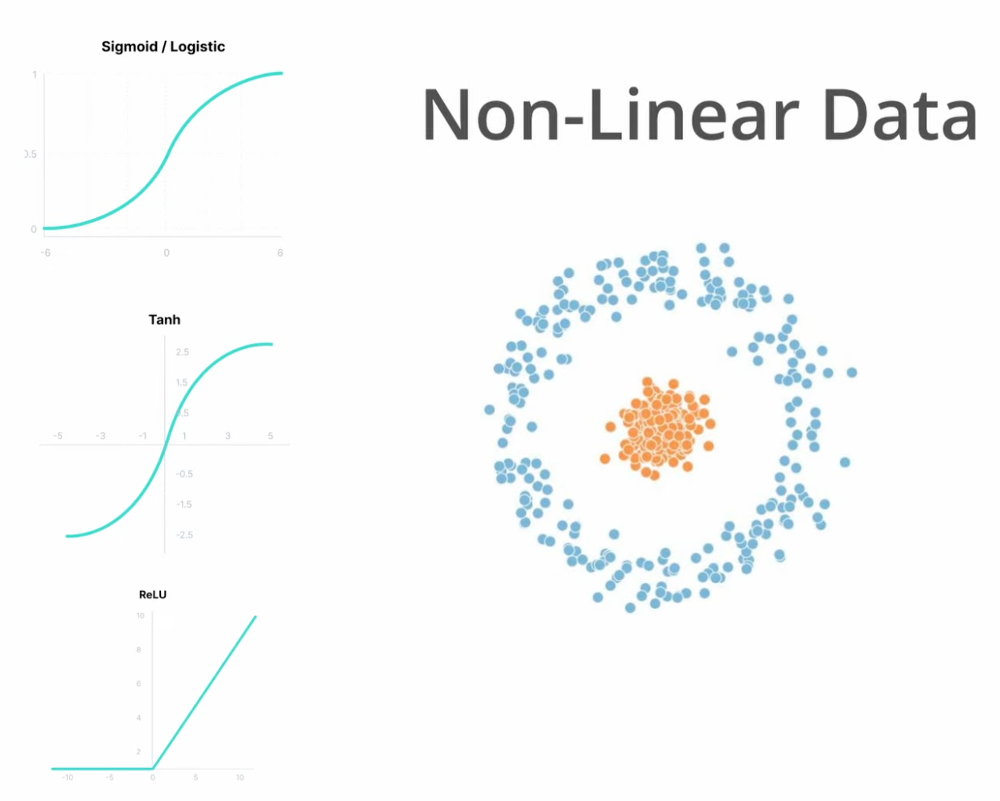 | 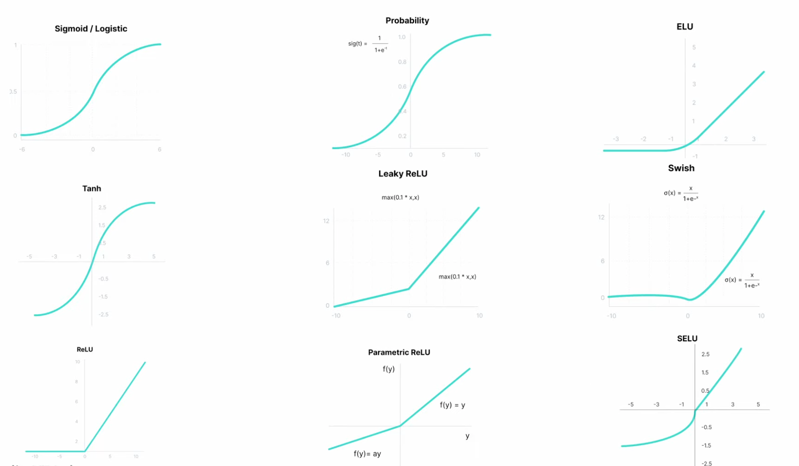 |

Based on the specific problem and dataset, different activation functions may be more suitable. Experimentation and evaluation are essential to determine the best choice for a given task.

For example, in hidden layers, ReLU is often preferred due to its efficiency and ability to mitigate the **vanishing gradient problem**. In contrast, Sigmoid or Tanh may be more appropriate for output layers in binary classification tasks.

- For **binary classification tasks**, the **Sigmoid activation function** is commonly used in the output layer because it maps the output to a **probability between 0 and 1**. 

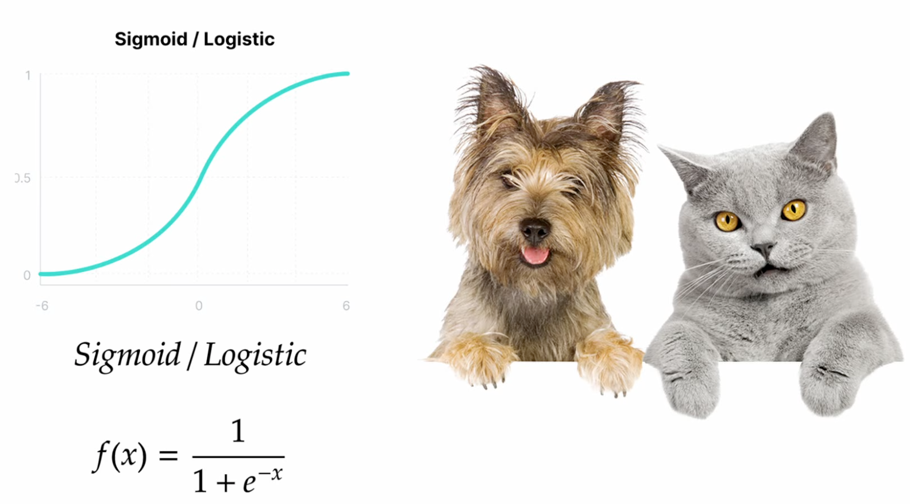

- For **multi-class classification tasks**, the **Softmax activation function** is often employed in the output layer to produce a **probability distribution over multiple classes**.

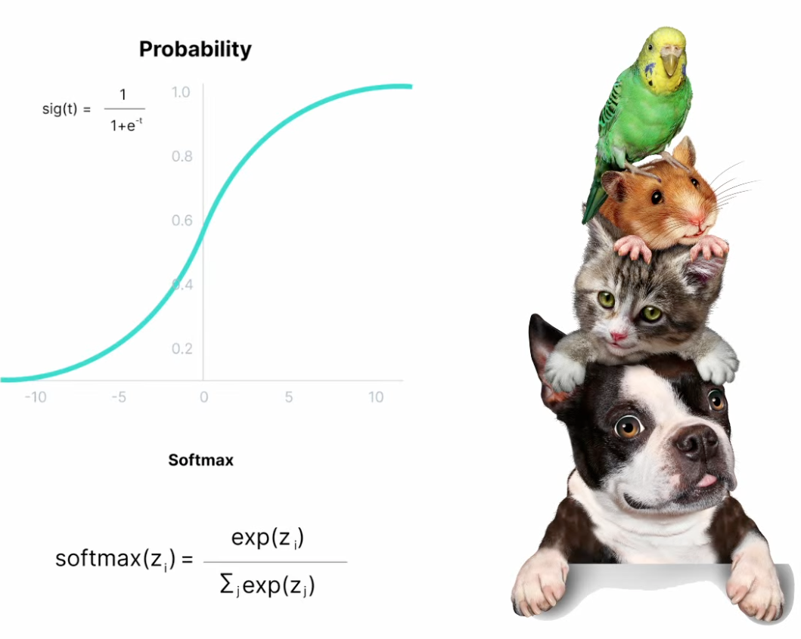

## 3. Loss Functions
Loss functions are mathematical functions that measure the difference between the **predicted output of a machine learning model and the actual target values**. They play a crucial role in training models by providing feedback on how well the model is performing. The **goal of training is to minimize the loss function**, which indicates that the model is making accurate predictions.

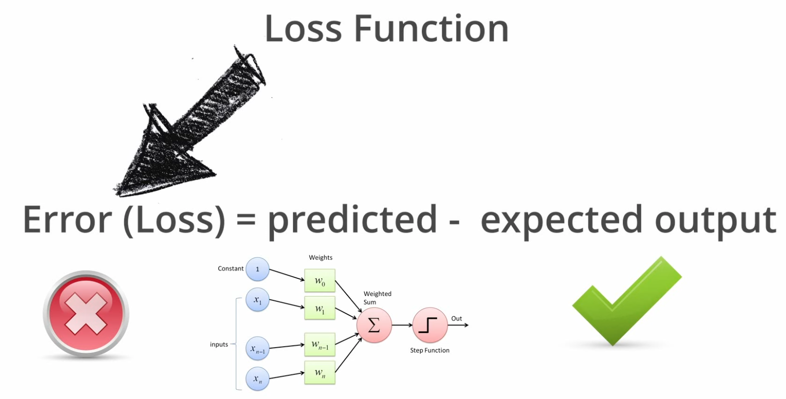

### Common Loss Functions
- **Mean Squared Error (MSE)**: Used for regression tasks, MSE calculates the average of the squared differences between predicted and actual values.
- **Cross-Entropy Loss**: Used for classification tasks, cross-entropy loss measures the difference between the predicted probability distribution and the actual distribution.
- **Hinge Loss**: Commonly used for support vector machines, hinge loss is used for "maximum-margin" classification.  

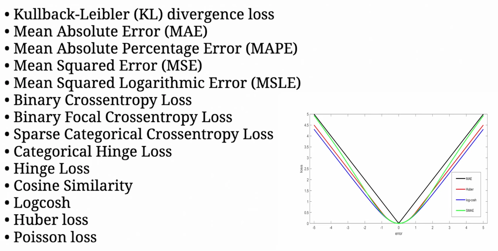

### Choosing the Right Loss Function
The choice of loss function depends on the specific task and the type of data being used. 

For example, 
  * MSE is suitable for regression problems 
  * Cross-entropy loss is more appropriate for classification tasks. 
  
It is essential to select a loss function that aligns with the model's objectives and the nature of the data.

## 4. Embeddings
Embeddings are dense vector representations of discrete data, such as words or items, in a continuous vector space. They capture semantic relationships between the data points, allowing machine learning models to understand and process them more effectively.

### One Hot encoding
One-hot encoding is a technique used to represent categorical data as binary vectors. Each category is represented by a vector with a single high (1) bit and all other bits low (0). This representation allows machine learning models to process categorical data effectively.

| One Hot Encoding | One Hot Encoding Representation|
|:-------------------------:|:------------------------:|
| 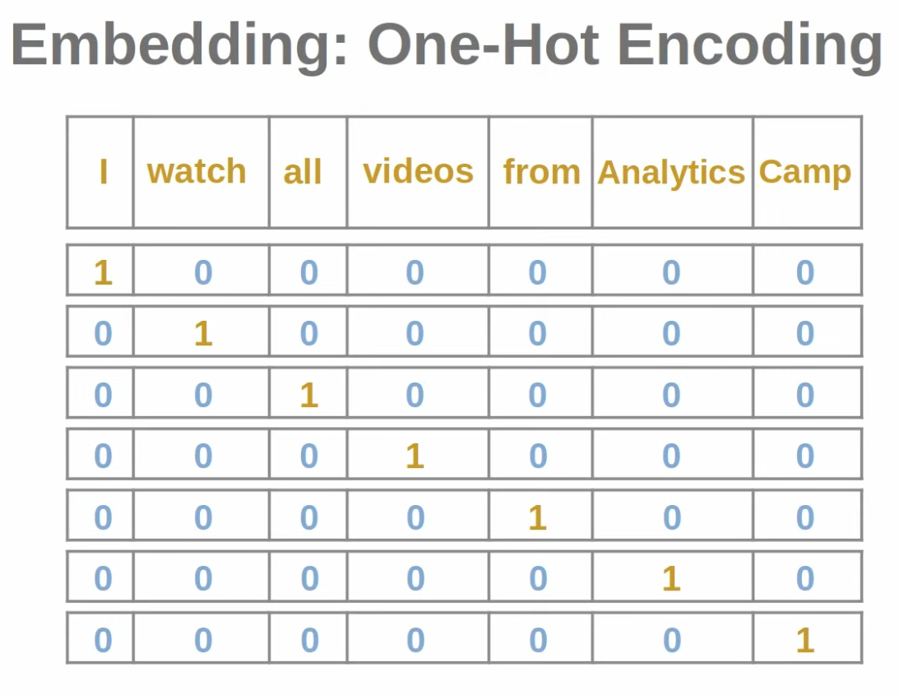 | 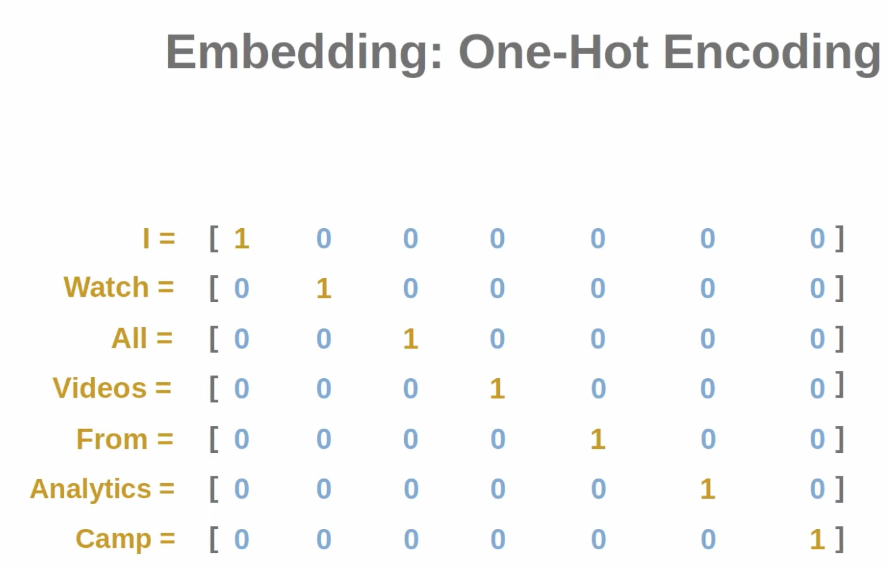 |

**Note**: Disadvantages of one-hot encoding include high dimensionality and sparsity, which can lead to inefficiencies in storage and computation.

### Embedding Techniques / Models
These embeddings capture semantic relationships between words, allowing models to understand context and meaning. Some popular embedding techniques and models include:

- **Word2Vec**: A popular technique for generating word embeddings using shallow neural networks.
- **GloVe (Global Vectors for Word Representation)**: A method that combines global matrix factorization and local context-based learning.
- **FastText**: An extension of Word2Vec that considers subword information for generating embeddings.
- **BERT (Bidirectional Encoder Representations from Transformers)**: A transformer-based model that generates contextual embeddings for words based on their surrounding context.
- **RoBERTa (Robustly Optimized BERT Pretraining Approach)**: An improved version of BERT that optimizes the pretraining process for better performance.

### Applications of Embeddings
- **Natural Language Processing (NLP)**: Embeddings are widely used in NLP tasks such as sentiment analysis, machine translation, and text classification.
- **Recommender Systems**: Embeddings can represent users and items, enabling personalized recommendations based on user preferences.
- **Computer Vision**: Embeddings can represent images or parts of images, facilitating tasks like image classification and object detection.

## 5. Gradient Descent Algorithm
**YouTube Link:** https://www.youtube.com/watch?v=IHZwWFHWa-w

Gradient Descent is an optimization algorithm used to minimize the loss function in machine learning models. It iteratively adjusts the model's parameters (weights and biases) in the direction of the steepest descent of the loss function.

| Gradient Descent | Gradient Descent|
|:-------------------------:|:------------------------:|
| 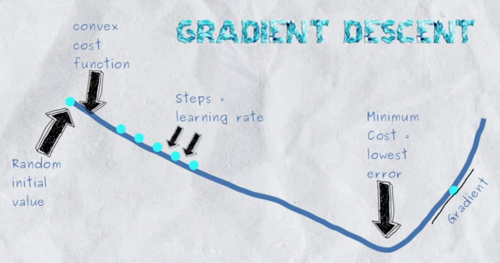 | 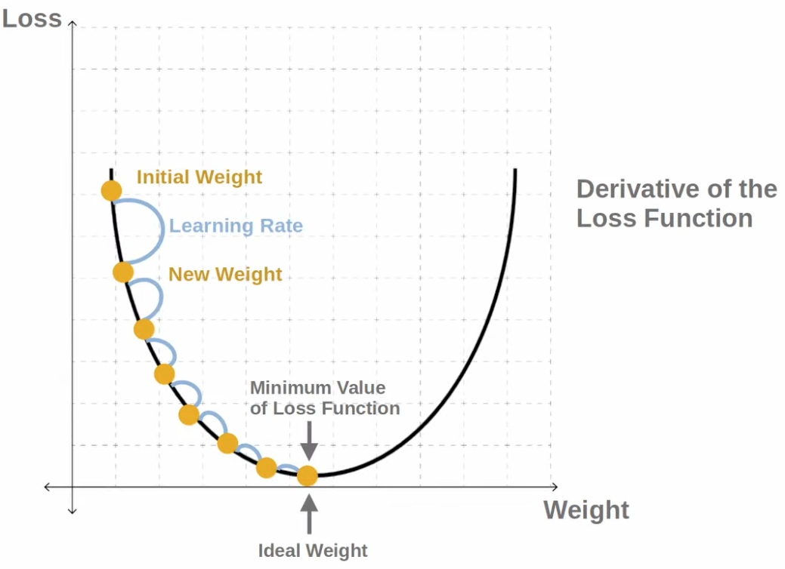 |

### How Gradient Descent Works
1. **Initialization**: Start with initial values for the model's parameters (weights and biases).
2. **Compute Gradient**: Calculate the gradient of the loss function with respect to each parameter. The gradient indicates the direction and rate of change of the loss function.
3. **Update Parameters**: Adjust the parameters by moving them in the opposite direction of the gradient. The size of the step is determined by the learning rate.
4. **Repeat**: Continue the process until convergence, where the loss function reaches a minimum or stops improving significantly.

### Learning Rate
The learning rate is a hyperparameter that controls the size of the steps taken during the parameter updates. A small learning rate may lead to slow convergence, while a large learning rate can cause overshooting the minimum.

### Variants of Gradient Descent
- **Batch Gradient Descent**: Uses the entire dataset to compute the gradient for each update. It is computationally expensive for large datasets.
- **Stochastic Gradient Descent (SGD)**: Uses a single training example to compute the gradient for each update. It is faster but introduces more noise in the updates.
- **Mini-batch Gradient Descent**: Uses a small subset of the dataset to compute the gradient for each update. It balances the benefits of batch and stochastic gradient descent.

### Importance of Gradient Descent
Gradient Descent is essential for training machine learning models, especially neural networks. It helps optimize the model's parameters to minimize the loss function, leading to better performance on training and unseen data. Proper tuning of the learning rate and choice of gradient descent variant can significantly impact the training process and final model quality.

## 6. Backpropagation

**YouTube Link:** https://www.youtube.com/watch?v=Ilg3gGewQ5U

Backpropagation is a **supervised learning algorithm** used for training artificial neural networks. It **efficiently computes the gradients needed for updating the weights and biases in the network** by applying the chain rule of calculus.

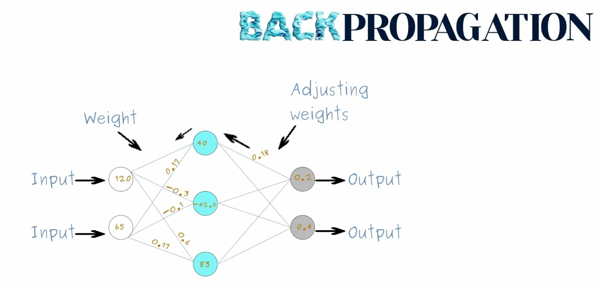 

### How Backpropagation Works
1. **Forward Pass**: Input data is passed through the network layer by layer to compute the output predictions.
2. **Compute Loss**: The loss function is calculated by comparing the predicted outputs to the actual target values.
3. **Backward Pass**: The gradients of the loss function with respect to each weight and bias are computed by propagating the error backward through the network.
4. **Update Parameters**: The weights and biases are updated using the computed gradients and an optimization algorithm like Gradient Descent.
### Chain Rule of Calculus
Backpropagation relies on the chain rule to compute the gradients efficiently. The chain rule allows the calculation of the derivative of a composite function by multiplying the derivatives of its constituent functions.
### Importance of Backpropagation
Backpropagation is crucial for training deep neural networks, as it enables the efficient computation of gradients for networks with many layers. It allows models to learn complex patterns in data by adjusting weights and biases based on the error signal. Without backpropagation, training deep networks would be computationally infeasible.
### Variants of Backpropagation
- **Standard Backpropagation**: The basic algorithm that computes gradients for all layers in the network.
- **Batch Backpropagation**: Computes gradients using the entire dataset for each update, similar to batch gradient descent.
- **Stochastic Backpropagation**: Computes gradients using a single training example for each update, similar to stochastic gradient descent.
- **Mini-batch Backpropagation**: Computes gradients using a small subset of the dataset for each update, similar to mini-batch gradient descent.
### Challenges in Backpropagation
- **Vanishing Gradients**: In deep networks, gradients can become very small, making it difficult for the model to learn.
- **Exploding Gradients**: Conversely, gradients can become very large, leading to unstable updates.
- **Overfitting**: Backpropagation can lead to overfitting if the model learns the training data too well without generalizing to unseen data.
### Solutions to Challenges
- **Normalization Techniques**: Methods like batch normalization can help mitigate vanishing and exploding gradients.
- **Regularization**: Techniques like dropout and L2 regularization can help prevent overfitting.
- **Advanced Optimization Algorithms**: Algorithms like Adam and RMSprop can improve the training process by adapting the learning rate for each parameter. 

## 7. Underfitting vs Overfitting
In machine learning, underfitting and overfitting are two common problems that can affect the performance of a model. Understanding the difference between these two issues is crucial for building effective models.
### Underfitting
Underfitting occurs when a model is too simple to capture the underlying patterns in the training data. As a result, the model performs poorly on both the training data and unseen data.
#### Causes of Underfitting
- Using a model that is too simple (e.g., linear model for complex data).
- Insufficient training time or iterations.
- Lack of relevant features in the input data.
#### Solutions to Underfitting
- Use a more complex model (e.g., deeper neural network).
- Increase training time or iterations.     
- Add more relevant features to the input data.
### Overfitting
Overfitting occurs when a model learns the training data too well, including its noise and outliers. As a result, the model performs well on the training data but poorly on unseen data.   
#### Causes of Overfitting
- Using a model that is too complex (e.g., deep neural network for simple data).
- Insufficient training data.
- Lack of regularization techniques.
#### Solutions to Overfitting
- Use a simpler model (e.g., shallower neural network).
- Increase the size of the training dataset.
- Apply regularization techniques (e.g., dropout, L2 regularization).
### Balancing Underfitting and Overfitting
To build effective machine learning models, it is essential to find a balance between underfitting and overfitting. This can be achieved through techniques such as cross-validation, hyperparameter tuning, and using appropriate model architectures. Monitoring the model's performance on both training and validation datasets can help identify and address these issues.

# 8. Vanishing Gradient Problem
The vanishing gradient problem is a common issue encountered during the training of deep neural networks, particularly those with many layers. It occurs when the gradients of the loss function with respect to the model's parameters become very small as they are propagated backward through the network during backpropagation. This leads to slow or stalled learning, as the weights and biases in the earlier layers receive minimal updates.
### Causes of the Vanishing Gradient Problem
- **Activation Functions**: Certain activation functions, such as the sigmoid and tanh functions, can cause gradients to shrink as they pass through multiple layers.
- **Deep Architectures**: The deeper the network, the more pronounced the vanishing gradient problem becomes, as gradients are multiplied through many layers.
### Consequences of the Vanishing Gradient Problem
- **Slow Convergence**: The model takes a long time to learn, as the weights and biases in the earlier layers are updated very slowly.
- **Poor Performance**: The model may fail to learn complex patterns in the data, leading to suboptimal performance on both training and unseen data.
### Solutions to the Vanishing Gradient Problem
- **Use of ReLU Activation Function**: The Rectified Linear Unit (ReLU) activation function helps mitigate the vanishing gradient problem by allowing gradients to flow more easily through the network.
- **Batch Normalization**: This technique normalizes the inputs to each layer, helping to maintain stable gradients during training.
- **Residual Connections**: Architectures like ResNet use skip connections to allow gradients to bypass certain layers, reducing the impact of vanishing gradients.
- **Proper Weight Initialization**: Techniques such as Xavier or He initialization can help maintain the scale of gradients during backpropagation.
### Importance of Addressing the Vanishing Gradient Problem
Addressing the vanishing gradient problem is crucial for training deep neural networks effectively. By implementing appropriate techniques and architectures, it is possible to ensure that gradients remain sufficiently large, allowing the model to learn complex patterns in the data and achieve better performance.

