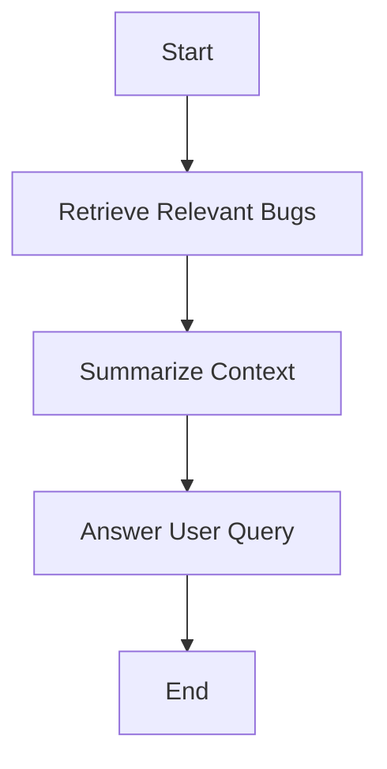

Great initiative — leveraging **Bugzilla’s historical bug discussions as a knowledge base** is a powerful way to build a deeply insightful, domain-specific AI assistant for **VMware vCenter**.

Let’s walk through how to build an **end-to-end Retrieval-Augmented Generation (RAG) AI solution** for this use case:

---

## 🚀 Goal

> **Build an intelligent AI assistant trained on 20 years of VMware Bugzilla bug reports (with comments), capable of answering technical/debugging questions about vCenter using prior bug resolutions and discussions.**

---

# ✅ Solution Overview

We'll build a **domain-specific RAG-based LLM system** that can:

* Ingest and structure **Bugzilla data** (bugs, comments, metadata)
* Preprocess and **chunk** the content
* **Embed** it using a domain-optimized embedding model
* Store the embeddings in a **vector database** (e.g., **FAISS**, **Chroma**, **Weaviate**, **Pinecone**)
* Build a **LangChain** or **LlamaIndex**-based RAG pipeline
* Integrate with **FastAPI** or chatbot frontend
* Use **OpenAI GPT-4**, **Claude**, or a **local LLM (e.g., Mistral, Llama 3)** to generate final responses with context retrieved from the vector DB

---

## 🧱 Architecture Overview

```text
User → FastAPI Chat UI → LangChain RAG Agent
                           |
            ┌──────────────┴─────────────┐
            |                            |
    Vector Store (FAISS, Chroma)     LLM (OpenAI / Local)
            ↑
     Embedding Model (e.g. BGE, OpenAI)
            ↑
   Bugzilla Data (Bugs + Comments)
```

---

## 📦 Step-by-Step End-to-End Pipeline

---

### **1. Data Ingestion from Bugzilla**

You’ll need to **extract and normalize Bugzilla data**.

* **What to extract:**

  * Bug ID, Title, Description
  * Comments (author, timestamp, body)
  * Status (resolved, duplicate, etc.)
  * Product / Component / Version
  * Resolution
  * Tags / Keywords

#### 🛠 Tools

* Use **Bugzilla API**, or dump raw database / XML / JSON files.
* Normalize into a structured format (e.g., JSONL or Pandas DataFrame).

```python
{
  "bug_id": "BUG12345",
  "title": "vMotion fails when DRS is enabled",
  "description": "...",
  "comments": [
    {"author": "engineer1", "text": "This is likely due to ..."},
    {"author": "qa_team", "text": "Confirmed on version 6.5"},
  ],
  "resolution": "FIXED",
  "product": "vCenter",
  "component": "DRS",
  ...
}
```

---

### **2. Preprocessing + Chunking**

You want to chunk the bug data (description + comments) into **context-aware blocks**.

#### ➕ Combine:

* Bug Title + Description
* All comments (or major ones) into meaningful segments.

#### ✂️ Chunking Strategy:

* Use semantic chunking (not fixed-size) to preserve discussion flow.
* Use tools like LangChain’s `RecursiveCharacterTextSplitter` or `MarkdownHeaderTextSplitter`.

```python
from langchain.text_splitter import RecursiveCharacterTextSplitter

text_splitter = RecursiveCharacterTextSplitter(chunk_size=1000, chunk_overlap=100)

docs = text_splitter.create_documents([bug_text])
```

---

### **3. Embedding Generation**

Use a high-quality embedding model to convert your bug data into vector representations.

#### 🔥 Recommended Embedding Models

| Model                    | Type        | Best For                     |
| ------------------------ | ----------- | ---------------------------- |
| `text-embedding-3-small` | OpenAI      | General, scalable            |
| `bge-base-en`            | HuggingFace | Better for domain-specific   |
| `E5-base`                | HF          | Tasks with reasoning context |

```python
from langchain.embeddings import HuggingFaceEmbeddings

embeddings = HuggingFaceEmbeddings(model_name="BAAI/bge-base-en-v1.5")
```

---

### **4. Vector Store (FAISS / Chroma / Weaviate)**

Index the embeddings in a vector database to allow fast semantic search.

```python
from langchain.vectorstores import FAISS

vectorstore = FAISS.from_documents(docs, embeddings)
vectorstore.save_local("bugzilla_faiss_index")
```

Other options:

* **Chroma** (lightweight, persistent)
* **Weaviate** (cloud-native, scalable)
* **Pinecone** (enterprise-grade)

---

### **5. Build RAG Pipeline using LangChain**

We'll retrieve top-k relevant chunks and pass them to the LLM for answer generation.

```python
from langchain.chains import RetrievalQA
from langchain.chat_models import ChatOpenAI

retriever = vectorstore.as_retriever(search_kwargs={"k": 5})

qa_chain = RetrievalQA.from_chain_type(
    llm=ChatOpenAI(model="gpt-4"),
    retriever=retriever,
    return_source_documents=True
)
```

---

### **6. Add Reasoning Agentic Behavior (LangGraph)**

Use **LangGraph** for advanced workflows like:

* Asking clarification
* Suggesting related bugs
* Navigating root cause → resolution path

#### Example graph:



You can also define **custom nodes** in LangGraph to chain tool use (e.g., query + suggest fixes).

---

### **7. FastAPI Interface (Chatbot API)**

Wrap the LangChain pipeline into a FastAPI endpoint:

```python
from fastapi import FastAPI
from pydantic import BaseModel

app = FastAPI()

class Query(BaseModel):
    question: str

@app.post("/ask")
def ask_question(query: Query):
    result = qa_chain.run(query.question)
    return {"answer": result}
```

You can also integrate this with:

* Slack bot
* VSCode plugin
* Web UI (e.g., Streamlit, React, etc.)

---

### **8. (Optional) Fine-Tune or Pretrain LLM**

If your data is large enough (hundreds of thousands of examples), you can:

* **Fine-tune a base LLM** (e.g., Mistral, Llama 3) using bug reports + responses.
* Use **LoRA adapters** to condition the LLM on VMware-specific language patterns.

Otherwise, stick with **RAG** — it’s more scalable and less resource-intensive.

---

## 🎯 Example Queries It Can Handle

* “Why does vMotion fail intermittently on vCenter 6.7?”
* “Has DRS caused host disconnection bugs in the past?”
* “What’s the workaround for ‘Resource pool not available’ error?”
* “Was this issue fixed in any patch release?”
* “What was the root cause of bug 123456?”

---

## 🧠 Why This Works

| Feature               | Benefit                                                       |
| --------------------- | ------------------------------------------------------------- |
| Bugzilla as Knowledge | Real-world, trusted internal documentation from field experts |
| RAG over LLM training | Fast, updatable, explainable                                  |
| Comments + metadata   | Gives deeper context and multi-perspective insights           |
| LangGraph reasoning   | Allows multi-step thinking and clarification                  |
| Search + LLM hybrid   | Combines precision with language understanding                |

---

## 📁 Folder Structure

```bash
bugzilla-ai-assistant/
├── data/
│   └── bugzilla_export.jsonl
├── ingest/
│   └── parse_and_chunk.py
├── rag/
│   ├── embed_and_index.py
│   └── rag_pipeline.py
├── api/
│   └── main.py (FastAPI)
├── models/
│   └── embeddings/
├── README.md
```

---

## ✅ Final Recommendations

* Start with a **subset** of bugs (e.g., only vCenter, past 5 years)
* Evaluate answers using actual tickets
* Add **citation / source return** from relevant bugs
* Continuously re-index with new bugs via nightly jobs

---

## 📦 Want a GitHub-ready starter repo?

I can generate a **starter GitHub repo** for you with:

* ✅ FAISS-based vector index
* ✅ HuggingFace BGE embeddings
* ✅ LangChain RAG pipeline
* ✅ LangGraph-based reasoning agent
* ✅ FastAPI chatbot interface

Let me know if you want that, and I’ll generate the code base or even deployable Docker setup.
