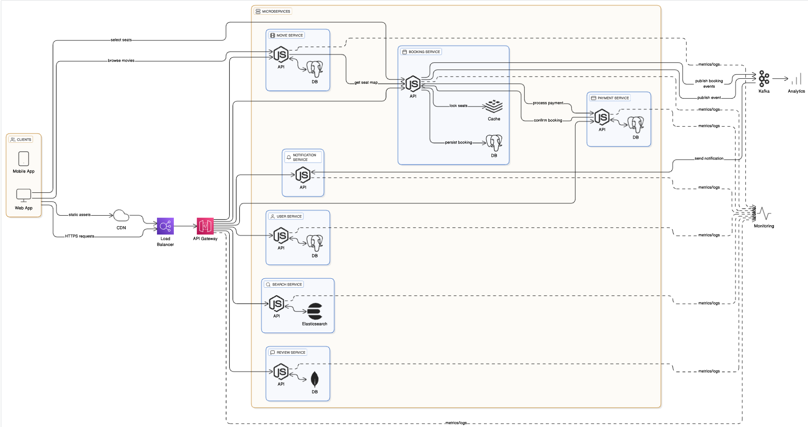

# Table of Contents
- [1. Quick elevator pitch / scope](#1-quick-elevator-pitch--scope)
- [2. Functional requirements](#2-functional-requirements)
- [3. Non-functional requirements (NFRs)](#3-non-functional-requirements-nfrs)
- [4. Back-of-envelope capacity planning (example)](#4-back-of-envelope-capacity-planning-example)
- [5. Core components (HLD)](#5-core-components-hld)
- [6. High-level request flow (booking)](#6-high-level-request-flow-booking)
- [7. Seat locking — core challenge](#7-seat-locking---core-challenge)
- [8. Database design and trade-offs](#8-database-design-and-trade-offs)
- [9. Cache strategy](#9-cache-strategy)
- [10. Data flow & consistency for booking (detailed)](#10-data-flow--consistency-for-booking-detailed)
- [11. Payment & refunds](#11-payment--refunds)
- [12. APIs (example)](#12-apis-example)
- [13. Reviews & social features](#13-reviews--social-features)
- [14. Scaling patterns & trade-offs](#14-scaling-patterns--trade-offs)
- [15. Reliability, fault tolerance & failure modes](#15-reliability-fault-tolerance--failure-modes)
- [16. Observability & operations](#16-observability--operations)
- [17. Security](#17-security)
- [18. Testing strategy](#18-testing-strategy)
- [19. Additional features & considerations](#19-additional-features--considerations)
- [20. Example low-level details](#20-example-low-level-details)
- [21. Data model (denormalized read model)](#21-data-model-denormalized-read-model)
- [22. Example trade-offs you can explain in interview](#22-example-trade-offs-you-can-explain-in-interview)
- [23. Real-world edge cases & how to handle](#23-real-world-edge-cases--how-to-handle)
- [24. Short checklist for interview demonstration](#24-short-checklist-for-interview-demonstration)    

### Architecture Overview
```
[Users] → [CDN] → [Load Balancer] → [API Gateway]
                                          ↓
    ┌─────────────────────────────────────┴─────────────────────┐
    ↓                    ↓                    ↓                  ↓
[User Service]  [Movie Service]  [Booking Service]  [Payment Service]
    ↓                    ↓                    ↓                  ↓
[User DB]         [Movie DB]         [Booking DB]         [Payment DB]
                                           ↓
                                    [Message Queue]
                                           ↓
                              [Notification Service]
```

```
┌─────────────────┐    ┌─────────────────────────────────────────────────┐
│   Client        │    │               API Gateway                       │
│ (Web/Mobile App)├───►│ (Routing, Rate Limiting, SSL Termination)       │
└─────────────────┘    └─────┬─────────────┬──────────────┬──────────────┘
                             │             │              │
                             ▼             ▼              ▼
                  ┌──────────────────┐  ┌────────────┐  ┌─────────────┐
                  │   Booking        │  │  Search    │  │  User       │
                  │   Service        │  │  Service   │  │  Service    │
                  │ (Core Logic)     │  │ (Elasticsearch)│ (Auth)      │
                  └─────────┬────────┘  └────────────┘  └─────────────┘
                            │
                            │ Publishes Booking Confirmed Event
                            ▼
                  ┌─────────────────────────────────┐
                  │       Message Queue (Kafka)     │
                  └─────┬─────────────┬─────────────┘
                        │             │
                        ▼             ▼
            ┌─────────────────────┐  ┌────────────────────┐
            │   Notification      │  │   Analytics        │
            │   Service (Email/SMS)│  │   Service (Data Warehouse)│
            └─────────────────────┘  └────────────────────┘
```



**Movie Ticket Booking System**: requirements, non-functional goals, back-of-envelope capacity planning, high-level architecture, low-level design details (DB schemas, APIs, locking strategies), trade-offs, and edge cases (payments, refunds, reviews, monitoring, testing). Use these as talking points in the interview — call out trade-offs, why you chose one approach over another, and alternatives.

# 1. Quick elevator pitch / scope

Design a service to let users search movies / shows, view seat maps, reserve (lock) seats, pay, and get confirmed tickets. System must scale to millions of users, support high concurrency during popular release times, minimize double-bookings, and provide low latency for seat availability queries.

# 2. Functional requirements

Must have:

* Browse movies, cinemas, showtimes.
* View seat map and real-time seat availability.
* Reserve (lock) seats for short period (e.g., 5–15 minutes).
* Complete booking with payment and persist confirmed tickets.
* Cancel bookings and process refunds.
* User account, booking history, and notifications (email/SMS).
* Admin: add movies, schedule shows, set pricing & discounts.
* Optional: movie ratings & reviews, dynamic pricing, gift/voucher codes.

# 3. Non-functional requirements (NFRs)

* Scalability: handle spikes (e.g., a big release) — tens to hundreds of K TPS for reads, thousands TPS for booking attempts.
* Availability: highly available (ideally >99.9%) for browsing; booking availability can tolerate short transient inconsistency if handled correctly.
* Consistency: seat allocation must be strongly consistent to avoid double-booking.
* Latency: seat availability and browsing responses < 200 ms typical.
* Security: PCI-DSS for payments, input validation, auth & authorization.
* Durability: booking data must be durable and ACID on confirmation.
* Observability: logs, metrics, tracing for debugging spikes and failures.

# 4. Back-of-envelope capacity planning (example)

Assume:

### Traffic Estimates

```
Daily Active Users (DAU): 10 million
Avg shows per day: 100,000 shows
Avg seats per show: 200 seats
Booking conversion rate: 5%
Peak hours: Evening (6 PM - 10 PM), weekends
```

```
Total bookings per day = 10M * 0.05 = 500,000 bookings
Bookings per second (avg) = 500,000 / 86,400 ≈ 6 bookings/sec
Peak bookings per second = 6 * 10 = 60 bookings/sec

Total seats = 100,000 shows * 200 seats = 20 million seats/day
Read:Write ratio = 100:1 (browsing vs booking)
```

### Storage Estimates
```
User data: 10M users * 1KB = 10 GB
Movie metadata: 10,000 movies * 100KB = 1 GB
Show data: 100K shows/day * 365 days * 1KB = 36.5 GB/year
Booking data: 500K bookings/day * 365 days * 2KB = 365 GB/year
Total (5 years): ~2 TB
```

### Bandwidth Estimates
```
Incoming: 60 bookings/sec * 10KB = 600 KB/sec
Outgoing: 6000 reads/sec * 50KB = 300 MB/sec
```
Rough TPS:

* Read (browse, seat map): majority — e.g., 10k–50k RPS at peak.
* Writes (book attempts): smaller — e.g., 1k–5k RPS peak (booking attempts).
  Design for 10k read RPS and 2k write RPS as a starting point; ensure auto-scaling for bursts.

# 5. Core components (HLD)

* API Gateway / Load Balancer
* Frontend (web, mobile) + CDN for static assets
* Microservices (or modular services):

  * Catalog Service (Theather, movies, shows, title, genre, cast, showtimes)
  * Seat Service / Availability Service (seat maps, reservations, inventory)
  * Booking Service (seat selection, locking, confirmations, ticket issuance)
  * Payment Service (or integrate with third-party PCI compliant provider)
  * User Service (accounts, history)
  * Notification Service (email/SMS)
  * Reviews Service (ratings & comments)
  * Pricing Service (dynamic pricing, discounts)
* Data stores:

  * Relational DB (primary booking & transactional data)
  * Cache (Redis) for seat locks and fast reads
  * Search engine (Elasticsearch) for search/browse
  * Event streaming (Kafka) for async workflows, analytics
* Monitoring & Logging: Prometheus, Grafana, ELK/Opensearch, tracing (Jaeger).
* Message queue (RabbitMQ/Kafka) for async tasks (notifications, refund processing).

# 6. High-level request flow (booking)

1. User loads show -> frontend requests seat map (cached).
2. Seat Service returns seat map + availability.
3. User selects seats -> client calls `ReserveSeats` (creates temporary lock).
4. Seat Service sets ephemeral locks (Redis or DB row lock) and returns lock token & TTL.
5. User provides payment info -> call Payment Service (external).
6. On successful payment: Booking Service creates confirmed booking, persists in RDBMS, issues ticket, publishes event `BookingConfirmed`.
7. Seat locks transitioned to “booked” (final).
8. Notifications sent (email/SMS). If payment fails or TTL expires, locks released.

# 6. Database Trade-offs
## SQL vs NoSQL

- **Choose SQL (PostgreSQL) for**:

    - Strong ACID guarantees (critical for bookings)
    - Complex joins (users, shows, bookings, seats)
    - Transaction support
    - Inventory consistency

- **Use NoSQL (MongoDB/Cassandra) for**:

  - Movie metadata (flexible schema)
  - User activity logs
  - Session data
  - Analytics data
  - User preferences
  - Caching layer

- **Sharding Strategy**

    - Shard bookings by theater_id or city
    - Keeps related data together
    - Reduces cross-shard transactions

- **Replication**

    - Master-Slave for read scalability
    - Read replicas for search, browsing
    - Write to master for bookings

Trade-offs:

- **SQL**:
    - Pros: Strong consistency, ACID transactions, suitable for bookings and payments.
    - Cons: Scales vertically, complex joins for large datasets.
    - **Use Case**: User data, bookings, payments, show schedules.
- **NoSQL**:
    - Pros: Scales horizontally, flexible schema for unstructured data.
    - Cons: Eventual consistency, less suited for complex transactions.
    - **Use Case**: Movie reviews, logs, or metadata.

Use PostgreSQL for transactional data to ensure consistency.
Use Redis for caching and fast access to frequently read data.
Use MongoDB for high-write, non-critical data like reviews to scale reads/writes.

Sharding: Shard booking data by show_id or theater_id for scalability.

Replication: Use read replicas for read-heavy operations (e.g., movie listings).


# 7. Seat locking — core challenge

Goal: prevent double booking while keeping low latency and allowing scale.

Common approaches:

* **Pessimistic locking (DB-level transaction locks)**

  * Acquire DB row lock on seat rows during reservation/booking.
  * Pros: strong consistency.
  * Cons: blocks and scales poorly under high contention; long transactions are bad.
* **Optimistic locking**

  * Use version numbers / compare-and-swap (CAS). Client reads seat state/version; on update ensure version unchanged.
  * Pros: avoids long locks, good when conflicts are rare.
  * Cons: many retries under high contention (popular shows).
* **Leases / ephemeral locks in Redis (recommended hybrid)**

  * Use Redis (SETNX with TTL or Redlock) to create a lock per seat or per-seat-block; lock token returned.
  * Keep lock TTL small (e.g., 5–15 minutes).
  * On payment, atomic move from “locked” → “booked” using DB transaction.
  * Pros: very fast reads/writes, handles scale, TTL auto-releases on client crash.
  * Cons: Redis single point — use clustering and replication; ensure correctness (use unique tokens and check token on release).
* **Seat allocation service with single writer per show (leader partitioning)**

  * Partition by show (show ID → leader node). Only leader writes seat status for that show. Use consistent hashing and a small number of leaders.
  * Pros: avoids cross-node conflicts, scalable.
  * Cons: must handle leader failover.

Recommended practical design:

* Use a **hybrid**:

  * Seat availability read through cache (Redis) and refreshed from authoritative RDBMS.
  * Reserve seats by atomically writing lock entries in Redis with TTL and token (SETNX or Lua script for multi-seat atomics).
  * On payment, Booking Service verifies lock token(s) and writes final booking to RDBMS inside a DB transaction. On success, remove lock(s) from Redis (or mark as booked).
  * If TTL expires, background process (or Redis expiry) releases locks.

Atomic multi-seat lock (Lua script) ensures either all seats locked or none.

# 8. Database design and trade-offs

Use relational DB (Postgres/MySQL) as the **source of truth** for bookings to get durable ACID guarantees.

Relational schema (simplified):

* `users(user_id, name, email, ...)`
* `cinemas(cinema_id, name, location, ...)`
* `screens(screen_id, cinema_id, capacity, ...)`
* `shows(show_id, screen_id, movie_id, start_time, end_time, ...)`
* `seats(seat_id, screen_id, seat_label, seat_type, ...)` — static seat layout
* `show_seats(show_seat_id, show_id, seat_id, status, price)` — per-show seat state
* `bookings(booking_id, user_id, show_id, status, total_price, payment_id, created_at)`
* `booking_items(booking_item_id, booking_id, show_seat_id, seat_label, price)`
* `payments(payment_id, booking_id, status, txn_ref, amount, created_at)`

Trade-offs:

* **Relational DB (ACID)**: use for correctness of bookings. Scaling: vertical scale + read replicas + sharding by show_id for extreme scale.
* **NoSQL (wide-column)**: could be used for user history or analytics; not recommended for booking state requiring strong consistency.
* **Event sourcing**: store events (`SeatLocked`, `SeatReleased`, `BookingConfirmed`) in an append-only store (Kafka + event store). Pros: full audit trail, easier to rebuild state; Cons: complexity.
* **Materialized view / read model**: keep a denormalized read DB for fast reads (seat map queries) rebuilt from events or sync processes.

Sharding strategy:

* **Shard by show_id or cinema_id**: all seats for a show live in same shard, greatly simplifies locking and reduces cross-shard transactions.
* Use consistent hashing or range-based sharding. Maintain directory service for mapping show → shard.

Replication:

* Use async read replicas for read scale. Writes must go to primary to preserve ACID.

Indexing:

* Index `show_id` on `show_seats`, `bookings(user_id)`, etc.

# 9. Cache strategy

* **Cache seat maps**: heavy reads — cache seat map JSON per show in Redis or CDN (for static parts); invalidate or update on write (booking).
* **Cache movie/cinema/catalog**: in-memory cache/Redis + TTL.
* **Be careful**: caching availability requires strict invalidation to avoid stale availability. Use short TTLs + pub/sub invalidation upon booking. Prefer Redis as a central fast cache with pub/sub for updates.
* **Edge cache / CDN**: static content only (images, trailers).


**Purpose**: Reduce database load and improve latency.

**Cache Layer**: Redis for in-memory caching.

**Cached Data:**
- Movie metadata (title, description, showtimes): Cache for 1 hour.
- Seat availability: Cache per show, invalidate on booking or lock.
- User sessions: Cache tokens for quick authentication.

**Cache Invalidation:**
- Invalidate seat cache on booking or lock expiration.
- Use LRU (Least Recently Used) eviction for memory management.

**Trad-offs:**
- Cache hits improve latency but risk stale data.
- Solution: Use short TTLs for dynamic data (e.g., seats) and longer TTLs for static data (e.g., movie details).


# 10. Data flow & consistency for booking (detailed)

* Reservation request:

  * Client calls `POST /shows/{show_id}/reserve` with seat list.
  * Server executes atomic lock in Redis Lua script:

    * Check each seat is not booked and not locked.
    * If all free → set lock tokens for each seat with TTL and store mapping `lock_id -> {user, seats, expiry}`.
    * Return `lock_id` & expiry.
* Payment:

  * Client calls `POST /book` with `lock_id` and payment details.
  * Booking Service:

    * Verify lock still valid (redis).
    * Call Payment gateway (idempotent) → on success:

      * Within DB transaction:

        * Double-check seat availability in DB (to be safe).
        * Insert `bookings` and `booking_items`.
        * Mark `show_seats` as `booked`.
      * Remove lock from Redis atomically.
      * Publish event `BookingConfirmed`.
  * If payment fails or timeout:

    * Release lock (Redis expiration or explicit).
    * Notify user.
* Idempotency:

  * Make booking requests idempotent using idempotency keys (client-supplied or server generated).
  * Payment calls should be idempotent to avoid duplicate charges.

# 11. Payment & refunds

* Do not store card data (use tokenization / third-party PCI service).
* Payment flows:

  * Synchronous: payment before booking confirmation (simple, but longer latency).
  * Asynchronous: start payment authorization, confirm booking after async callback — requires robust state machine and idempotent callbacks.
* Refunds: async process (queue), update booking status, issue refund through payment provider, and publish events.

# 12. APIs (example)

* `GET /movies` — list/search movies
* `GET /shows?movie_id=&cinema_id=&date=` — list shows
* `GET /shows/{show_id}/seats` — seat map & availability
* `POST /shows/{show_id}/reserve` `{user_id, seats[]}` → `{lock_id, expiry}`
* `POST /booking` `{lock_id, payment_token, user_id, idempotency_key}` → booking confirmation
* `POST /booking/{booking_id}/cancel` — cancel/refund
* `GET /user/{user_id}/bookings` — history
* `POST /reviews` — create movie review

# 13. Reviews & social features

* Store reviews separate from booking DB (scalable service).
* Schema: `reviews(review_id, user_id, movie_id, rating, text, created_at)`.
* Use moderation (automated filters + manual review).
* Maintain aggregated rating per movie (denormalized) and cache it.
* Use Elasticsearch for searching reviews/comments.

# 14. Scaling patterns & trade-offs

* **Read-heavy**: use caches, read replicas, and denormalized read models.
* **Write contention (popular shows)**:

  * Partitioning/sharding by show to localize write contention.
  * Use Redis locks + leader per show approach.
  * For extreme contention (ticket drops), consider queuing attempts and issuing lottery-like allocation or token-based purchase windows.
* **Availability vs Consistency (CAP)**:

  * For seat booking, prefer **consistency** for final booking — can't allow double-booking.
  * For browsing, prefer availability and low latency.
* **Eventual consistency** acceptable for some derived views (analytics, history) but not for booking state.

# 15. Reliability, fault tolerance & failure modes

* Redis failure: use Redis Cluster with persistence; if cache lost, rebuild from DB or mark as maintenance. Use distributed locks carefully; do not rely on single Redis for correctness—use clustering and TTLs.
* DB primary failure: automatic failover with replication. During failover, bookings should be slowed or queued; ensure idempotency and reconciliation.
* Payment gateway timeout: release locks after TTL; support clearing of stale locks.
* Network partitions: when partitioned, prioritize correctness for booking — prefer fail closed (deny booking) rather than risking double-book.
* Crash recovery: have background job to reconcile locks vs DB (e.g., expired locks but DB booked — remove locks; booked seats without DB — alert).

# 16. Observability & operations

* Metrics to watch: lock acquisition rate, lock expiration count, booking success/fail rate, payment latency, error rates, API latency, DB replication lag.
* Alerts: high lock expirations, DB primary down, payment failure surge.
* Distributed tracing for request flows (frontend → seat service → payment → booking).
* Blue/green and canary deploys for services.

# 17. Security

* OAuth2 / JWT for user auth.
* Rate limiting to prevent bots and DDoS.
* CAPTCHA or bot mitigation on high-demand bookings.
* PCI compliance for payments — use third-party, do not handle raw cards.
* Input validation & SQL injection prevention.
* Proper access control for admin endpoints.

# 18. Testing strategy

* Unit tests + integration tests for DB transactions.
* Load testing and chaos testing for spikes (use k6, JMeter, Locust).
* Fault injection: kill leader nodes, simulate Redis failover, network partitions.
* Reconciliation tests: ensure eventual consistency between Redis locks and DB.
* Security testing & penetration tests.

# 19. Additional features & considerations

* **Dynamic pricing**: price tiers, surge pricing for high demand; implement via Pricing Service and precompute per seat or per seat-type.
* **Group bookings**: atomic multi-seat locking (Lua script).
* **Split payments / promotions / seat holds for group**: complexity increases; need atomicity and partial refunds handling.
* **Offline / box office**: allow staff to book via separate channel — ensure same seat APIs used to avoid divergence.
* **Audit trail**: for compliance and dispute resolution, store events for every state change.
* **Ticket formats**: QR codes / barcode generation; unique per booking.
* **Partner integrations**: 3rd-party resellers, aggregator marketplaces — design APIs & rate limits.

# 20. Example low-level details

## Multi-seat Redis lock (conceptual Lua logic)

* Input: show_id, [seat_ids], lock_token, ttl
* For each seat key `lock:{show_id}:{seat_id}`:

  * If exists and value != expired → return failure
* If all free → SET each key = lock_token with TTL in a single script (atomic)
* Return success

## Booking confirmation transaction (pseudo SQL)

```sql
BEGIN;
-- double-check seats are available
SELECT status FROM show_seats WHERE show_id = ? AND seat_id IN (...) FOR UPDATE;

-- ensure all are 'available'
-- insert booking
INSERT INTO bookings (...) VALUES (...);
INSERT INTO booking_items(...) VALUES (...);
-- update seat status
UPDATE show_seats SET status='booked', booking_id = ? WHERE show_id=? AND seat_id IN (...);
COMMIT;
```

## Idempotency

* Store `idempotency_key` with booking attempts to ensure duplicate client retries don’t create duplicates.
* Check idempotency store before processing.

# 21. Data model (denormalized read model)

* `show_availability(show_id, seat_map_json, last_updated)` — used by read endpoints (fast reads).
* Update this read model synchronously or via events after booking confirmation.

# 22. Example trade-offs you can explain in interview

* DB vs Redis for locks: Redis is fast & scalable but ephemeral; DB is durable but slower — hybrid gives best of both.
* Strong consistency vs availability: for seat booking choose strong consistency; for browsing choose availability.
* Single leader per show vs distributed locks: leader simplifies conflict resolution but introduces leader failover complexity.
* Event sourcing: great for auditability but increases operational complexity.

# 23. Real-world edge cases & how to handle

* **User abandons checkout**: lock TTL expiry and background cleanup. Consider also soft-hold for short time + confirmation window.
* **Payment succeeded but callback lost**: use webhook retries, idempotency, and reconcile through periodic job comparing payment provider records.
* **Double clicks & duplicate requests**: use client-side disable + server idempotency keys.
* **Multiple devices**: lock must be associated with user + token; if lock requested from device B, either deny or refresh depending on policy.
* **Booking modifications**: treat as cancel + new booking or special change API with atomic seat swap logic.
* **Fraud / bots**: rate limit, challenge-response, device fingerprinting.

# 24. Short checklist for interview demonstration

* Start by stating assumptions & scale (users, TPS).
* Draw HLD: client → LB → API → microservices (show seat service, booking, payments) → storage.
* Explain seat locking approach (Redis locks + DB transaction) and why.
* Discuss data modeling (schema) and sharding strategy.
* Talk about caching and how to keep it consistent.
* Explain payment flow and idempotency.
* Explain monitoring, alerts, and testing.
* Cover failure cases and reconciliation.
* End with alternative approaches and trade-offs (event sourcing, leader per show, pure DB locks).

---

If you like, I can:

* produce a one-page interview cheat sheet (concise bullets),
* draw a sequence diagram for the booking flow,
* produce sample API definitions (OpenAPI/Swagger),
* or produce a runnable prototype of the locking + booking transaction using Redis + Postgres pseudo code.

Which of those would you like next?
