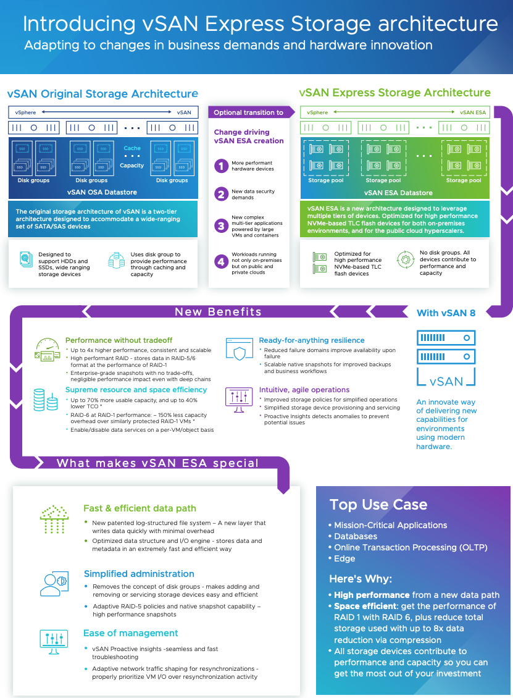

## Table of Contents
- [VMC on AWS upgrades](#vmc-on-aws-upgrades)
- [End-to-End Upgrade + Backup/Restore Flow](#end-to-end-upgrade---backuprestore-flow)
- [What is PoP in VMC on AWS?](#what-is-pop-in-vmc-on-aws)
- [RCE PRE - POST Checks](#rce-pre---post-checks)
- [BRS (Backup and Restore Service) in VMC on AWS](#brs-backup-and-restore-service-in-vmc-on-aws)
- [vSan on AWS](#vsan-on-aws)
- [HCX](#hcx)
- [vSan architecture](#vsan-architecture)
- [Cloud-Native OLTP Database Design](#cloud-native-oltp-database-design)
- [AWS Database Backup & DR Design — Resiliency, Fault Tolerance, Availability](#aws-database-backup--dr-design--resiliency-fault-tolerance-availability)
- [Transactional Database – SalesforceDB Notes](#transactional-database--salesforcedb-notes)
- [VMware Backup & Restore – Detailed Explanation](#vmware-backup--restore--detailed-explanation)
- [How Backups Rely on VM Snapshots](#how-backups-rely-on-vm-snapshots)
- [How Veeam Takes Backup and Stores It](#how-veeam-takes-backup-and-stores-it)
- [SDDC Upgrade States](#sddc-upgrade-states)

# VMC on AWS upgrades
#### Who Manages Upgrades
- VMware is fully responsible for upgrades in VMC on AWS (not the customer).
- Customers can choose upgrade windows (maintenance preference), but can’t control the upgrade process itself**.

**Upgrades cover:**
- **Management Plane** → vCenter, NSX, HCX appliances, VMware’s management stack.
- **Data Plane** → ESXi hosts, vSAN, networking datapath.
- **RCE (Release Control Plane)** → orchestrates upgrades across customers.
- **RLCM (Release Lifecycle Manager)** → executes the lifecycle workflows (patch, rollback, re-image).

#### Upgrade Execution

Upgrades happen in a phased order:

- Step 1 – Management Plane
    - vCenter Server is upgraded first (new appliance or patched).
    - NSX Manager upgraded/redeployed → ensures networking and security stack is - up-to-date.
    - HCX appliances (if used) are updated.
    - RLCM ensures rollback option by using pre-upgrade backups.
- Step 2 – ESXi Hosts (Rolling Upgrade)
    - Hosts are upgraded one at a time:
        - Host is placed in maintenance mode.
        - vMotion migrates running VMs to other hosts (no downtime).
        - Upgrade or re-image of ESXi is performed.
        - Host exits maintenance → VMs may return via DRS load balancing.
    - Repeat until all hosts are upgraded.
- Step 3 – vSAN
    - Since vSAN is tied to ESXi kernel, vSAN bits are upgraded during ESXi upgrade.
    - Metadata and objects are upgraded after all hosts are on new version.
    - This is online and non-disruptive.

# End-to-End Upgrade + Backup/Restore Flow
- RLCM schedules upgrade → notifies tenant.
- RCE runs pre-checks (health, capacity, HA).
- Backup of management plane components taken automatically.
- Upgrade executed step by step (vCenter → NSX → ESXi hosts)- 
- If failure- 
    - RLCM restores from backup → full rollback to pre-upgrade state.
- If success:
    - Backups retired, new version becomes active.

#Customer Workloads During Upgrade
- No downtime expected:
    - Workload VMs are vMotioned live.
    - HA/DRS maintain VM placement.
- Customers don’t need to shut down workloads.
- If extra safety is needed → customers may run their own workload-level backups (VCDR, Veeam, etc.).

----
# What is PoP in VMC on AWS?
In VMC on AWS, a PoP (Point of Presence) is the network edge node managed by VMware that connects your SDDC to AWS, VMware services, and the Internet.

- Deployed in a redundant architecture across multiple availability zones.
- Ensures failover in case of a PoP or link outage.
- Provides service continuity during upgrades or failures.

#### Its main roles & responsibilities are:
- Connectivity (VPN, Direct Connect, AWS services)
- Traffic management (routing, ingress/egress control)
- Security enforcement (firewall, NAT, segmentation)
- Service integration (linking VMware + AWS + on-prem)
- Resiliency (HA, failover, redundancy)

------
# RCE PRE - POST Checks
### 1. Pre-Upgrade Checks (Before Upgrade Starts)
✅ Management Plane
- vCenter health:
    - Appliance services running.
    - Database consistency.
    - API/UI responsiveness.
- NSX Manager health:
    - Cluster nodes reachable.
    - Management/control/data plane functional.
    - Edge node status (if applicable).
- HCX appliances (if deployed): health and reachability.

✅ Cluster/Host Level
- Host state:
    - No hosts in a failed/disconnected state.
    - Sufficient cluster resources (CPU, memory).
    - DRS enabled and functioning.
- **vMotion health:** ensure VMs can be migrated during rolling host upgrades.
- **HA configuration:** validated so failover works if needed.
- **Host maintenance mode readiness:** confirm workloads can evacuate safely.

✅ vSAN (Storage)
- vSAN Health service checks:
    - Cluster partition status (all nodes in same cluster).
    - Disk group health.
    - Component state (no inaccessible objects).
    - Storage policy compliance.
    - Resync queue empty (no outstanding object rebuilds).
- Capacity check:
    - Enough free space for “Ensure Accessibility” or “RAID-1 FTT=1” operations.

✅ Networking
- NSX logical switch/segment health.
- Routing and firewall rule consistency.
- Connectivity between hosts for vSAN and vMotion networks.

✅ Operational
- **Upgrade compatibility matrix:** verify current version is supported for target upgrade.
- **Temporary host capacity:** check if a non-billable spare host is needed for rolling upgrade.
- **Snapshot/backup of management appliances** created.

### 2. Post-Upgrade Checks (After Upgrade Completes)

✅ Management Plane
- **vCenter**: upgraded version running, services healthy, API/UI reachable.
- **NSX Manager**: cluster status green, control/data plane functional.
- **HCX appliances**: operational and registered correctly.

✅ Cluster/Host Level
- All hosts upgraded and in connected state.
- DRS & HA functional after upgrade.
- VMs distributed properly across cluster.
- No host in maintenance mode after completion.

✅ vSAN (Storage)
- All hosts on same vSAN version.
- Disk format upgrade status: started/complete, no failures.
- No resync backlog.
- Objects compliant with storage policies.
- Deduplication/compression state verified (for node types that support it).

✅ Networking
- Overlay/underlay connectivity validated.
- Edge services (NAT, VPN, load balancer) functional.
- Distributed firewall rules intact.

✅ Operational
- Teemetry back to RCE → confirms successful upgrade.
- Logs validated for errors during upgrade.
- Temporary host removed if one was added.
- Rollback checkpoints cleaned up (backups retired).

# BRS (Backup and Restore Service) in VMC on AWS
- It’s an internal service used by VMware to protect the management plane during operations like upgrades or patching.
- Customers do not interact with BRS directly (no self-service backup/restore).

- Backups are stored in a separate, secure AWS S3 bucket managed by VMware inside the Service Provider’s (VMware’s) AWS account, not the customer’s account.
- The bucket is region-specific and located in the same region as your SDDC to avoid latency.
- Backups are encrypted (AES-256 at rest) and replicated across multiple AZs for durability

## When Does BRS Run?
#### 1. Before critical lifecycle events:
- SDDC upgrades (vCenter, NSX, HCX, ESXi/vSAN upgrades).
- Management component patching.
- Some catastrophic recovery operations triggered by VMware Support.

#### 2. What Components Does BRS Protect?
 BRS backs up management plane only, not customer VMs. Specifically:
- vCenter Server Appliance (VCSA)
    - Configuration database
    - Inventory (clusters, hosts, resource pools, VMs, templates)
    - Identity sources and permissions
- NSX Manager/NSX-T Manager
    - Management plane configuration
    - Control plane state
    - Networking objects (segments, T1/T0 gateways, firewall rules, routing policies, security groups, etc.)
- Control plane configuration, policies, security rules, routing tables.
- HCX Manager (if deployed).
    - Site pairing configuration
    - Service mesh setup
    - Migration plans and settings
- SDDC configuration metadata
    -  Cluster layout, networking (segments, gateways, firewall rules), identity sources, certificates.
- vSAN Configuration Metadata
    - Disk group layout, object metadata
    - Cluster policies (SPBM rules)

**Note** : 
- 👉 It does NOT back up workload VMs or vSAN datastore data.
- 👉 Customer VMs must be protected by customer-owned solutions (VCDR, Veeam, etc.).

#### 3. How BRS Takes Backups
- RCE triggers BRS before upgrades.
- BRS creates application-consistent snapshots of management appliances.
- Backups are stored in an internal VMware-managed repository (isolated, secure, not exposed to customer).
- They are short-lived, kept only until upgrade completes successfully.

#### 4. What Happens if Upgrade Fails?
- Failure during management plane upgrade (example: NSX upgrade crashes mid-way):
    - RLCM detects failure → instructs BRS to restore affected components from pre-upgrade backup.
    - Example: redeploy NSX Manager VMs from backup image, restore config.
- Failure during host/vSAN upgrade:
    - Hosts are stateless and can be re-imaged back to the old ESXi/vSAN version.
    - vSAN data remains intact (since it’s distributed and redundant).
- Once restore completes → SDDC is back to last known good state before upgrade.

#### 5. What Happens if Upgrade Succeeds?
- After successful upgrade, those BRS backups are deleted.
- They are not for long-term recovery.
- New version becomes the active baseline.

#### 6. Restore Workflow if Upgrade Fails
If an upgrade fails at any stage:
- BRS detects the failure (through RLCM/RCE monitoring).
- The failed component (say, NSX Manager) is rolled back by restoring from the last BRS backup.
- Restore is component-specific (only the failed component is restored, not the whole SDDC).
- If multiple dependencies are impacted, BRS can orchestrate a multi-component restore (for example, NSX Manager + vCenter).
- Once restore is complete, the system is validated for consistency before retrying upgrade.

# vSan on AWS
In VMC on AWS, you don’t manually set up vSAN like you would in an on-prem vSphere cluster. VMware abstracts and automates it for you, but under the hood it’s still standard vSAN technology with some AWS-specific integration. **Let’s break it down:**

- Every SDDC cluster in VMC uses vSAN as its primary storage for both management VMs (vCenter, NSX, HCX appliances) and customer workload VMs.
- There’s no separate SAN/NAS in VMC. Storage is fully integrated into the ESXi hosts via vSAN.
### 1. How vSAN is Enabled
- When you deploy an SDDC:
- VMware automatically enables vSAN across all ESXi hosts in the cluster.
- Each ESXi host in AWS has:
- NVMe flash devices for cache tier.
- NVMe capacity devices for capacity tier.
- These devices are claimed by vSAN and form a single distributed datastore that you see as vsanDatastore in vCenter.
- we don’t run esxcli vsan ... commands or configure disk groups; it’s part of the SDDC automation.

### How vSAN is Configured
**Disk Groups:** Automatically created — each host contributes both cache and capacity devices.
**Deduplication & Compression:**
    - Enabled for i3 nodes (all-flash).
    - Not supported on some newer node types (e.g., i4i) because they use more efficient high-density NVMe.
**Storage Policy-Based Management (SPBM):**
    - You define policies (FTT=1, RAID-1 vs RAID-5/6, stripe width, etc.).
    - vSAN ensures data placement based on policy.
**vSAN Datastore:**
    - Exposed as a single datastore to all cluster hosts.
    - Expands automatically when you add hosts.

### Integration with AWS
**Capacity Scaling:**
- You scale storage by adding hosts (scale-out).
- There’s no native vSAN scale-up by adding disks, because AWS node SKUs are fied.
**Elastic vSAN (with EBS):**
- In newer offerings, you can extend vSAN capacity with Amazon EBS volumes instead of adding a full ESXi host (cost optimization).
- This is enabled/configured by VMware — you request storage expansion in the console, and vSAN automatically adds EBS-backed capacity.
**Encryption:**
- All vSAN datastores are encrypted by default using vSAN Encryption with AWS **KMS** integration (no manual setup required).

### Management / Operations
**From vCenter in VMC, you can:**
- View vsanDatastore.
- Create/modify storage policies.
- Monitor capacity, IOPS, latency, dedupe ratios.
**What you cannot do:**
- Manually configure disk groups, enable/disable dedupe/compression, or mix disk types.
- These are fixed by VMware’s managed service design.

---
# HCX

VMware HCX (Hybrid Cloud Extension) is an application mobility platform that simplifies and automates the migration, rebalancing, and continuity of workloads across on-premises vSphere environments and different cloud platforms. It achieves this by creating a secure, optimized, and high-throughput hybrid network interconnect, allowing for seamless live or bulk migration of virtual machines (VMs) between sites
- **Key Benefits**
    - **Zero Downtime Migrations**: Performs live migrations without disrupting operations. 
    - **IP Address Preservation**: Workloads retain their original IP addresses and network configurations post-migration. 
    - **Enhanced Security**: Secures migration traffic with strong encryption. 
    - **WAN Optimization**: Improves migration performance over the WAN with de-duplication and traffic engineering. 

# vSan architecture

-----------------


---


# SDDC Upgrade States
```
public enum SddcUpgradeState implements WorkflowState {
    NEW("New", WorkflowStateType.Preparing),
    FAILED("Failed", WorkflowStateType.Failed),
    WAITING("Waiting", WorkflowStateType.Waiting),
    HEALTH_CHECK("Health Check", WorkflowStateType.Action),
    MAINTENANCE_STARTED("Maintenance Started", WorkflowStateType.Action),
    BACKING_UP("Backing Up", WorkflowStateType.Action),
    CANCELED("Canceled", WorkflowStateType.Canceled),
    UPGRADING_POP("Upgrading POP", WorkflowStateType.Action),
    POD_PREP("POD Prep", WorkflowStateType.Action),
    POD_PRE_CHECKS("POD Pre-Checks", WorkflowStateType.Action),
    POD_STAGING_UPDATES("POD Staging Updates", WorkflowStateType.Action),
    POD_UPDATING_CONTROL_PLANE("POD Updating Control Plane", WorkflowStateType.Action),
    HCX_UPGRADING("HCX Upgrading", WorkflowStateType.Action),
    WAITING_POST_CONTROL_PLANE("Waiting Post-Control Plane", WorkflowStateType.Action),
    POST_CONTROL_PLANE_BACKUP("Post-Control Plane Backup", WorkflowStateType.Action),
    ADDING_HOST("Adding Host", WorkflowStateType.Action),
    DATA_PLANE_PRE_CHECK("Data Plane Pre-Check", WorkflowStateType.Action),
    POD_UPDATING_DATA_PLANE("POD Updating Data Plane", WorkflowStateType.Action),
    REMOVING_HOST("Removing Host", WorkflowStateType.Action),
    POD_INDEPENDENT_UPDATE("POD Independent Update", WorkflowStateType.Action),
    POST_UPGRADE_CHECKS("Post-Upgrade Checks", WorkflowStateType.Action),
    POST_UPGRADE_STEPS("Post-Upgrade Steps", WorkflowStateType.Action),
    @Deprecated
    IN_TRIAL("In Trial", WorkflowStateType.Action),
    PROCESSED("Processed", WorkflowStateType.Processed),
    COMPLETED("Completed", WorkflowStateType.Processed),
    NO_UPGRADE_NEEDED("No Upgrade Needed", WorkflowStateType.Processed),

    //RTS states
    RTS_POST_UPDATE_COORDINATOR("RTS Post-Update Coordinator", WorkflowStateType.Action),
    RTS_BEFORE_CONTROL_PLANE("RTS Before Control Plane", WorkflowStateType.Action),
    RTS_POST_CONTROL_PLANE("RTS Post-Control Plane", WorkflowStateType.Action),
    RTS_BEFORE_VIBS("RTS Before VIBS", WorkflowStateType.Action),
    RTS_BEFORE_DATA_PLANE("RTS Before Data Plane", WorkflowStateType.Action),
    RTS_BEFORE_NSXT_PRE_CHECK("RTS Before NSX-T Pre-Check", WorkflowStateType.Action),

    NSXT_HEALTH_CHECK("NSX-T Health Check", WorkflowStateType.Action),
    NSXT_BACKUP("NSX-T Backup", WorkflowStateType.Action),
    NSXT_POD_PREP("NSX-T POD Prep", WorkflowStateType.Action),
    NSXT_CONTROL_PLANE_PRE_CHECK("NSX-T Control Plane Pre-Check", WorkflowStateType.Action),
    NSXT_DATA_PLANE_PRE_CHECK("NSX-T Data Plane Pre-Check", WorkflowStateType.Action),
    NSXT_POD_UPDATE_COORDINATOR("NSX-T POD Update Coordinator", WorkflowStateType.Action),
    NSXT_CONTROL_PLANE_CHECK("NSX-T Control Plane Check", WorkflowStateType.Action),
    NSXT_DATA_PLANE_CHECK("NSX-T Data Plane Check", WorkflowStateType.Action),
    NSXT_ADD_HOST("NSX-T Add Host", WorkflowStateType.Action),
    NSXT_POD_UPDATE_VIBS("NSX-T POD Update VIBS", WorkflowStateType.Action),
    NSXT_REMOVE_HOST("NSX-T Remove Host", WorkflowStateType.Action),
    NSXT_COMPLETE("NSX-T Complete", WorkflowStateType.Action);

  

    NSX V2 State

     /* Happy path states. */
    NEW("New", WorkflowStateType.Preparing),
    WAITING("Waiting", WorkflowStateType.Waiting),
    PRE_MIGRATION_PRECHECK("Pre-Migration Pre-Check", WorkflowStateType.Action),
    PRE_MIGRATION_HEALTH_CHECK("Pre-Migration Health Check", WorkflowStateType.Action),
    PRE_MIGRATION_CREATE_FIREWALL_RULE("Pre-Migration Create Firewall Rule", WorkflowStateType.Action),
    PRE_MIGRATION_BACKUP("Pre-Migration Backup", WorkflowStateType.Action),
    SETUP_TRANSIT_HOST("Setup Transit Host", WorkflowStateType.Action),
    PREPARE_MIGRATION("Prepare Migration", WorkflowStateType.Action),
    PRE_MIGRATION_PRECHECK_RERUN("Pre-Migration Pre-Check Re-Run", WorkflowStateType.Action),
    LOGICAL_CONSTRUCTS("Logical Constructs", WorkflowStateType.Action),
    EDGE_MIGRATION("Edge Migration", WorkflowStateType.Action),
    INFRA_MIGRATION("Infra Migration", WorkflowStateType.Action),
    APPLIANCE_MIGRATION_AND_CLEANUP("Appliance Migration and Cleanup", WorkflowStateType.Action),
    REDEPLOY_POP("Re-Deploy POP", WorkflowStateType.Action),
    POST_MIGRATION_WORK("Post-Migration Work", WorkflowStateType.Action),
    MIGRATED_BACKUP("Migrated Backup", WorkflowStateType.Action),
    MIGRATED_HEALTH_CHECKS("Migrated Health Checks", WorkflowStateType.Action),
    MIGRATED_REMOVE_FIREWALL_RULE("Migrated Remove Firewall Rule", WorkflowStateType.Action),
    MIGRATED("Migrated", WorkflowStateType.Action),
    COMPLETED("Completed", WorkflowStateType.Processed),

    /* Pre-migration check path states. */
    PRECHECK_OUTSIDE_MW("Pre-Check Outside MW", WorkflowStateType.Action),
    HEALTHCHECK_OUTSIDE_MW("Health Check Outside MW", WorkflowStateType.Action),
    COMPLETE_VERIFICATION("Complete Verification", WorkflowStateType.Action),

    /* Pre-migration feedback path states. */
    GET_FEEDBACK_OUTSIDE_MW("Get Feedback Outside MW", WorkflowStateType.Action),
    AWAITING_FEEDBACK_RESPONSE_OUTSIDE_MW("Awaiting Feedback Response Outside MW", WorkflowStateType.Action),
    SUBMIT_FEEDBACK_OUTSIDE_MW("Submit Feedback Outside MW", WorkflowStateType.Action),

    /* Rollback States. */
    ROLLBACK("Rollback", WorkflowStateType.Action),
    ROLLBACK_SUCCESS("Rollback Success", WorkflowStateType.Action),

    /* Error, etc states. */
    FAILED("Failed", WorkflowStateType.Failed),
    CANCELLED("Cancelled", WorkflowStateType.Canceled),

    @Deprecated
    PRECHECK_INSIDE_MW("Pre-Check Inside MW", WorkflowStateType.Action);


    HostMigrationState implements WorkflowState {
    NEW("New", WorkflowStateType.Preparing),
    WAITING("Waiting", WorkflowStateType.Waiting),
    RUNNING_PRE_CHECKS("Running Pre-Checks", WorkflowStateType.Action),
    BACKING_UP("Backing Up", WorkflowStateType.Action),
    RUNNING_ENC_SETUP("Running ENC Setup", WorkflowStateType.Action),
    RUNNING_PRE_STEPS("Running Pre-Steps", WorkflowStateType.Action),
    ADDING_HOST_TO_CLUSTER("Adding Host to Cluster", WorkflowStateType.Action),
    RUNNING_VSAN_CHECKS("Running VSAN Checks", WorkflowStateType.Action),
    BACKING_UP_POST_ADD_HOST("Backing Up Post-Add Host", WorkflowStateType.Action),
    REMOVING_HOST_FROM_CLUSTER("Removing Host from Cluster", WorkflowStateType.Action),
    FEATURE_FLAG_ENABLEMENT("Feature Flag Enablement", WorkflowStateType.Action),
    RUNNING_POST_STEPS("Running Post-Steps", WorkflowStateType.Action),
    RUNNING_POST_CHECKS("Running Post-Checks", WorkflowStateType.Action),

    SUCCEEDED("Succeeded", WorkflowStateType.Processed),
    FAILED("Failed", WorkflowStateType.Failed),
    CANCELED("Canceled", WorkflowStateType.Canceled),
    COMPLETED("Completed", WorkflowStateType.Processed),
    MIGRATION_NOT_REQUIRED("Migration Not Required", WorkflowStateType.Processed);


    DfcState implements WorkflowState {
    NEW("New", WorkflowStateType.Preparing),
    TIME_ESTIMATE("Time Estimate", WorkflowStateType.Preparing),
    RTS_GETTING_ADDITIONAL_HOST_COUNT_FOR_ESTIMATE("RTS Getting Additional Host Count For Time Estimation", WorkflowStateType.Preparing),
    SEND_SCHEDULED_NOTIFICATION("Send Scheduled Notification", WorkflowStateType.Preparing),
    WAITING("Waiting", WorkflowStateType.Waiting),
    DFC_NOT_REQUIRED("DFC Not Required", WorkflowStateType.Processed),
    RUNNING_HEALTH_CHECKS("Running Health Checks", WorkflowStateType.Action),
    PRE_DFC_BACKING_UP("Pre-DFC Backing Up", WorkflowStateType.Action),
    RTS_GETTING_ADDITIONAL_HOST_COUNT("RTS Getting Additional Host Count", WorkflowStateType.Action),
    ADDING_HOST("Adding Host", WorkflowStateType.Action),
    RUNNING_DFC_SETUP_STEPS("Running DFC Setup Steps", WorkflowStateType.Action),
    RUNNING_DFC_TASK("Running DFC Task", WorkflowStateType.Action),
    REMOVING_HOST("Removing Host", WorkflowStateType.Action),
    RUNNING_POST_CHECKS("Running Post Checks", WorkflowStateType.Action),
    POST_DFC_BACKING_UP("Post-DFC Backing Up", WorkflowStateType.Action),
    DFC_TASK_CANCELED("DFC Task Canceled", WorkflowStateType.Canceled),
    FAILED("Failed", WorkflowStateType.Failed),
    CANCELLED("Cancelled", WorkflowStateType.Canceled),
    SUCCEEDED("Succeeded", WorkflowStateType.Processed),
    COMPLETED("Completed", WorkflowStateType.Processed);


     NEW("New", WorkflowStateType.Preparing),
    DURATION_ESTIMATE("Duration Estimate", WorkflowStateType.Preparing),
    WAITING("Waiting", WorkflowStateType.Waiting),
    RUNNING_PRE_CHECKS("Running Pre-Checks, no other running upgrade, no cssd etc", WorkflowStateType.Action),
    RTS_BEFORE_CONVERSION("RTS_BEFORE_CONVERSION", WorkflowStateType.Action),
    RTS_BEFORE_PPG_CONVERSION("RTS script to execute before ppg-conversion", WorkflowStateType.Action),
    RUNNING_CONVERSION("Running conversion", WorkflowStateType.Action),
    PAUSE_CONVERSION("Pause conversion", WorkflowStateType.Action),
    PAUSED("Paused conversion", WorkflowStateType.Paused),
    CANCEL_CONVERSION("Cancel conversion", WorkflowStateType.Canceled),
    RTS_AFTER_CONVERSION("RTS_AFTER_CONVERSION", WorkflowStateType.Action),
    RTS_AFTER_PPG_CONVERSION("RTS script to execute after ppg-conversion", WorkflowStateType.Action),

    SUCCEEDED("Succeeded", WorkflowStateType.Processed),
    FAILED("Failed", WorkflowStateType.Failed),
    CANCELED("Canceled", WorkflowStateType.Canceled),
    COMPLETED("Completed", WorkflowStateType.Processed),
    MIGRATION_NOT_REQUIRED("Migration Not Required", WorkflowStateType.Processed),
    NO_CONVERSION_NEEDED("NO_CONVERSION_NEEDED", WorkflowStateType.Processed),
    NONE_STATE("NONE_STATE", WorkflowStateType.Processed),
    PROCESSED("Processed", WorkflowStateType.Processed);


    x-vmw-vapi-discriminated-by: "SDDC_UPGRADE"
    allOf:
    - $ref: '#/definitions/Context'
    - properties:
        bundle_url:
          type: string
        bundleId:
          type: string
        current_state:
          type: string
          enum:
          - NEW
          - FAILED
          - WAITING
          - HEALTH_CHECK
          - MAINTENANCE_STARTED
          - BACKING_UP
          - CANCELED
          - UPGRADING_POP
          - POD_PREP
          - POD_PRE_CHECKS
          - POD_STAGING_UPDATES
          - POD_UPDATING_CONTROL_PLANE
          - HCX_UPGRADING
          - WAITING_POST_CONTROL_PLANE
          - POST_CONTROL_PLANE_BACKUP
          - ADDING_HOST
          - DATA_PLANE_PRE_CHECK
          - POD_UPDATING_DATA_PLANE
          - REMOVING_HOST
          - POD_INDEPENDENT_UPDATE
          - POST_UPGRADE_CHECKS
          - POST_UPGRADE_STEPS
          - PROCESSED
          - COMPLETED
          - NO_UPGRADE_NEEDED
          - NSXT_BACKUP
          - NSXT_POD_PREP
          - NSXT_CONTROL_PLANE_PRE_CHECK
          - NSXT_DATA_PLANE_PRE_CHECK
          - NSXT_POD_UPDATE_COORDINATOR
          - NSXT_CONTROL_PLANE_CHECK
          - NSXT_DATA_PLANE_CHECK
          - NSXT_ADD_HOST
          - NSXT_POD_UPDATE_VIBS
          - NSXT_REMOVE_HOST
          - NSXT_COMPLETE
        nsx_workflow_run:
          type: boolean
        nsxt_reservation_window_start:
          type: string
        nsxt_reservation_id:
          type: string
        state_history:
          type: array
          items:
            type: string
            enum:
            - NEW
            - FAILED
            - WAITING
            - HEALTH_CHECK
            - MAINTENANCE_STARTED
            - BACKING_UP
            - CANCELED
            - UPGRADING_POP
            - POD_PREP
            - POD_PRE_CHECKS
            - POD_STAGING_UPDATES
            - POD_UPDATING_CONTROL_PLANE
            - HCX_UPGRADING
            - WAITING_POST_CONTROL_PLANE
            - POST_CONTROL_PLANE_BACKUP
            - ADDING_HOST
            - DATA_PLANE_PRE_CHECK
            - POD_UPDATING_DATA_PLANE
            - REMOVING_HOST
            - POD_INDEPENDENT_UPDATE
            - POST_UPGRADE_CHECKS
            - POST_UPGRADE_STEPS
            - PROCESSED
            - COMPLETED
            - NO_UPGRADE_NEEDED
            - NSXT_BACKUP
            - NSXT_POD_PREP
            - NSXT_CONTROL_PLANE_PRE_CHECK
            - NSXT_DATA_PLANE_PRE_CHECK
            - NSXT_POD_UPDATE_COORDINATOR
            - NSXT_CONTROL_PLANE_CHECK
            - NSXT_DATA_PLANE_CHECK
            - NSXT_ADD_HOST
            - NSXT_POD_UPDATE_VIBS
            - NSXT_REMOVE_HOST
            - NSXT_COMPLETE
        event_history:
          type: array
          items:
            type: string
            enum:
            - NEW
            - PREPARE
            - RESCHEDULE
            - CANCEL
            - SNOOZE
            - PRE_HEALTH_CHECK
            - CHECK_POD_HEALTH
            - CHECK_DATA_PLANE_HEALTH
            - CHECK_VMC_SERVICE_HEALTH
            - CHECK_HCX_ACCESS
            - CHECK_SERVICE_DESK_INCIDENT
            - START
            - BACKUP
            - BACKUP_UPDATE
            - UPGRADE_POP
            - UPGRADE_POP_TASK_STATUS
            - DEPLOY
            - DEPLOY_UPDATE
            - UPDATE_POD
            - ADD_HOST
            - CHECK_TASK_STATUS
            - REMOVE_HOST
            - POST_HEALTH_CHECK
            - POST_DATA_PLANE_HEALTH_CHECK
            - POST_UPGRADE_VERSION_CHECK
            - START_POST_UPGRADE_STEPS
            - RELEASED
            - RETRY
            - RETRY_PREPARE
            - RETRY_START
            - RETRY_BACKUP
            - RETRY_POP_UPGRADE
            - RETRY_POD_PREP
            - RETRY_POST_UPGRADE
            - RETRY_ADD_HOST
            - RETRY_DATA_PLANE_DEPLOY
            - RETRY_POST_CONTROLPLANE_BACKUP
            - RETRY_CHECK_POD_HEALTH
            - RETRY_REMOVE_HOST
            - RETRY_POST_UPGRADE_CHECKS
            - RETRY_POST_UPGRADE_STEPS
            - SKYS_SERVICE_NOTIFICATION_FAILED
            - SKYS_SERVICE_NOTIFICATION_FINISHED
            - COMPLETE
            - HCX_UPGRADE
            - RETRY_HCX_UPGRADE
            - NSXT_RESCHEDULE
            - NSXT_UPDATE_START
            - NSXT_BACKUP
            - NSXT_POD_PREP
            - NSXT_CONTROL_PLANE_PRE_CHECK
            - NSXT_DATA_PLANE_PRE_CHECK
            - NSXT_POD_UPDATE_COORDINATOR
            - NSXT_CONTROL_PLANE_CHECK
            - NSXT_DATA_PLANE_CHECK
            - NSXT_ADD_HOST
            - NSXT_POD_UPDATE_VIBS
            - NSXT_REMOVE_HOST
            - NSXT_COMPLETE
            - RETRY_NSXT_BACKUP
            - RETRY_NSXT_POD_PREP
            - RETRY_NSXT_CONTROL_PLANE_CHECK
            - RETRY_NSXT_POD_UPDATE_COORDINATOR
            - RETRY_NSXT_ADD_HOST
            - RETRY_NSXT_POD_UPDATE_VIBS
            - RETRY_NSXT_REMOVE_HOST
            - PROCEED_NEXT
            - SKIP_POST_UPGRADE_STEPS
            - SKIP_NSXT_REMOVE_HOST
            - SKIP_HEALTH_CHECK
    title: SddcUpgradeContext

```

=======
**Santosh Patha**

Performance-driven engineering leader with extensive expertise in delivering results within multinational environments. Technical and management experience in developing mission-critical data center system software with strong focus on distributed file systems, virtualization, disaster recovery, cloud gateways and storage management.

Specialties (Technical): Distributed systems, Storage Management, File Systems, Virtualization, Cloud computing, Backup, Data Protection, Business Continuity, Disaster Recovery, Cloud Storage, Cloud Gateway, Big data

Specialties (Management): People Management, Engineering Management, Project Management, OEM Relationship
- Experience building highly scalable and highly available distributed systems
- Strong background in developing backup and restore features for cloud databases
- Hands-on experience with Kubernetes for building and operating production-grade clusters (required)
- Proficiency with CI/CD pipelines and Infrastructure-as-Code tools (required)
- Proficient in Java development