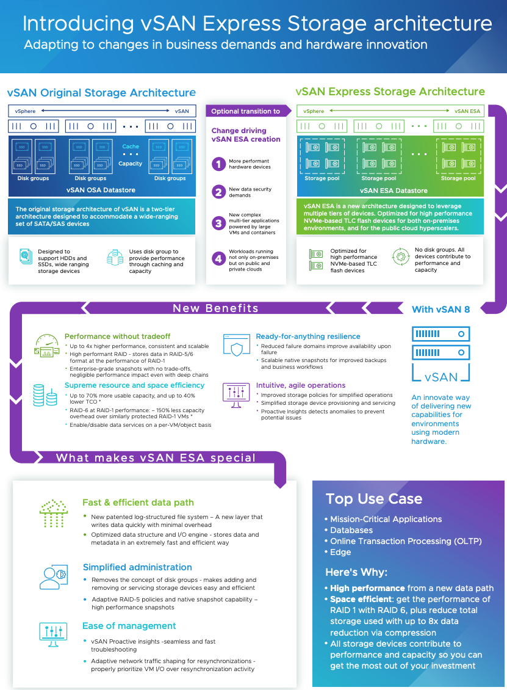

## Table of Contents
- [VMC on AWS upgrades](#vmc-on-aws-upgrades)
- [End-to-End Upgrade + Backup/Restore Flow](#end-to-end-upgrade---backuprestore-flow)
- [What is PoP in VMC on AWS?](#what-is-pop-in-vmc-on-aws)
- [RCE PRE - POST Checks](#rce-pre---post-checks)
- [BRS (Backup and Restore Service) in VMC on AWS](#brs-backup-and-restore-service-in-vmc-on-aws)
- [vSan on AWS](#vsan-on-aws)
- [HCX](#hcx)
- [vSan architecture](#vsan-architecture)
- [Cloud-Native OLTP Database Design](#cloud-native-oltp-database-design)
- [AWS Database Backup & DR Design — Resiliency, Fault Tolerance, Availability](#aws-database-backup--dr-design--resiliency-fault-tolerance-availability)
- [Transactional Database – SalesforceDB Notes](#transactional-database--salesforcedb-notes)
- [VMware Backup & Restore – Detailed Explanation](#vmware-backup--restore--detailed-explanation)
- [How Backups Rely on VM Snapshots](#how-backups-rely-on-vm-snapshots)
- [How Veeam Takes Backup and Stores It](#how-veeam-takes-backup-and-stores-it)
- [SDDC Upgrade States](#sddc-upgrade-states)

# VMC on AWS upgrades
#### Who Manages Upgrades
- VMware is fully responsible for upgrades in VMC on AWS (not the customer).
- Customers can choose upgrade windows (maintenance preference), but can’t control the upgrade process itself**.

**Upgrades cover:**
- **Management Plane** → vCenter, NSX, HCX appliances, VMware’s management stack.
- **Data Plane** → ESXi hosts, vSAN, networking datapath.
- **RCE (Release Control Plane)** → orchestrates upgrades across customers.
- **RLCM (Release Lifecycle Manager)** → executes the lifecycle workflows (patch, rollback, re-image).

#### Upgrade Execution

Upgrades happen in a phased order:

- Step 1 – Management Plane
    - vCenter Server is upgraded first (new appliance or patched).
    - NSX Manager upgraded/redeployed → ensures networking and security stack is - up-to-date.
    - HCX appliances (if used) are updated.
    - RLCM ensures rollback option by using pre-upgrade backups.
- Step 2 – ESXi Hosts (Rolling Upgrade)
    - Hosts are upgraded one at a time:
        - Host is placed in maintenance mode.
        - vMotion migrates running VMs to other hosts (no downtime).
        - Upgrade or re-image of ESXi is performed.
        - Host exits maintenance → VMs may return via DRS load balancing.
    - Repeat until all hosts are upgraded.
- Step 3 – vSAN
    - Since vSAN is tied to ESXi kernel, vSAN bits are upgraded during ESXi upgrade.
    - Metadata and objects are upgraded after all hosts are on new version.
    - This is online and non-disruptive.

# End-to-End Upgrade + Backup/Restore Flow
- RLCM schedules upgrade → notifies tenant.
- RCE runs pre-checks (health, capacity, HA).
- Backup of management plane components taken automatically.
- Upgrade executed step by step (vCenter → NSX → ESXi hosts)- 
- If failure- 
    - RLCM restores from backup → full rollback to pre-upgrade state.
- If success:
    - Backups retired, new version becomes active.

#Customer Workloads During Upgrade
- No downtime expected:
    - Workload VMs are vMotioned live.
    - HA/DRS maintain VM placement.
- Customers don’t need to shut down workloads.
- If extra safety is needed → customers may run their own workload-level backups (VCDR, Veeam, etc.).

----
# What is PoP in VMC on AWS?
In VMC on AWS, a PoP (Point of Presence) is the network edge node managed by VMware that connects your SDDC to AWS, VMware services, and the Internet.

- Deployed in a redundant architecture across multiple availability zones.
- Ensures failover in case of a PoP or link outage.
- Provides service continuity during upgrades or failures.

#### Its main roles & responsibilities are:
- Connectivity (VPN, Direct Connect, AWS services)
- Traffic management (routing, ingress/egress control)
- Security enforcement (firewall, NAT, segmentation)
- Service integration (linking VMware + AWS + on-prem)
- Resiliency (HA, failover, redundancy)

------
# RCE PRE - POST Checks
### 1. Pre-Upgrade Checks (Before Upgrade Starts)
✅ Management Plane
- vCenter health:
    - Appliance services running.
    - Database consistency.
    - API/UI responsiveness.
- NSX Manager health:
    - Cluster nodes reachable.
    - Management/control/data plane functional.
    - Edge node status (if applicable).
- HCX appliances (if deployed): health and reachability.

✅ Cluster/Host Level
- Host state:
    - No hosts in a failed/disconnected state.
    - Sufficient cluster resources (CPU, memory).
    - DRS enabled and functioning.
- **vMotion health:** ensure VMs can be migrated during rolling host upgrades.
- **HA configuration:** validated so failover works if needed.
- **Host maintenance mode readiness:** confirm workloads can evacuate safely.

✅ vSAN (Storage)
- vSAN Health service checks:
    - Cluster partition status (all nodes in same cluster).
    - Disk group health.
    - Component state (no inaccessible objects).
    - Storage policy compliance.
    - Resync queue empty (no outstanding object rebuilds).
- Capacity check:
    - Enough free space for “Ensure Accessibility” or “RAID-1 FTT=1” operations.

✅ Networking
- NSX logical switch/segment health.
- Routing and firewall rule consistency.
- Connectivity between hosts for vSAN and vMotion networks.

✅ Operational
- **Upgrade compatibility matrix:** verify current version is supported for target upgrade.
- **Temporary host capacity:** check if a non-billable spare host is needed for rolling upgrade.
- **Snapshot/backup of management appliances** created.

### 2. Post-Upgrade Checks (After Upgrade Completes)

✅ Management Plane
- **vCenter**: upgraded version running, services healthy, API/UI reachable.
- **NSX Manager**: cluster status green, control/data plane functional.
- **HCX appliances**: operational and registered correctly.

✅ Cluster/Host Level
- All hosts upgraded and in connected state.
- DRS & HA functional after upgrade.
- VMs distributed properly across cluster.
- No host in maintenance mode after completion.

✅ vSAN (Storage)
- All hosts on same vSAN version.
- Disk format upgrade status: started/complete, no failures.
- No resync backlog.
- Objects compliant with storage policies.
- Deduplication/compression state verified (for node types that support it).

✅ Networking
- Overlay/underlay connectivity validated.
- Edge services (NAT, VPN, load balancer) functional.
- Distributed firewall rules intact.

✅ Operational
- Teemetry back to RCE → confirms successful upgrade.
- Logs validated for errors during upgrade.
- Temporary host removed if one was added.
- Rollback checkpoints cleaned up (backups retired).

# BRS (Backup and Restore Service) in VMC on AWS
- It’s an internal service used by VMware to protect the management plane during operations like upgrades or patching.
- Customers do not interact with BRS directly (no self-service backup/restore).

- Backups are stored in a separate, secure AWS S3 bucket managed by VMware inside the Service Provider’s (VMware’s) AWS account, not the customer’s account.
- The bucket is region-specific and located in the same region as your SDDC to avoid latency.
- Backups are encrypted (AES-256 at rest) and replicated across multiple AZs for durability

## When Does BRS Run?
#### 1. Before critical lifecycle events:
- SDDC upgrades (vCenter, NSX, HCX, ESXi/vSAN upgrades).
- Management component patching.
- Some catastrophic recovery operations triggered by VMware Support.

#### 2. What Components Does BRS Protect?
 BRS backs up management plane only, not customer VMs. Specifically:
- vCenter Server Appliance (VCSA)
    - Configuration database
    - Inventory (clusters, hosts, resource pools, VMs, templates)
    - Identity sources and permissions
- NSX Manager/NSX-T Manager
    - Management plane configuration
    - Control plane state
    - Networking objects (segments, T1/T0 gateways, firewall rules, routing policies, security groups, etc.)
- Control plane configuration, policies, security rules, routing tables.
- HCX Manager (if deployed).
    - Site pairing configuration
    - Service mesh setup
    - Migration plans and settings
- SDDC configuration metadata
    -  Cluster layout, networking (segments, gateways, firewall rules), identity sources, certificates.
- vSAN Configuration Metadata
    - Disk group layout, object metadata
    - Cluster policies (SPBM rules)

**Note** : 
- 👉 It does NOT back up workload VMs or vSAN datastore data.
- 👉 Customer VMs must be protected by customer-owned solutions (VCDR, Veeam, etc.).

#### 3. How BRS Takes Backups
- RCE triggers BRS before upgrades.
- BRS creates application-consistent snapshots of management appliances.
- Backups are stored in an internal VMware-managed repository (isolated, secure, not exposed to customer).
- They are short-lived, kept only until upgrade completes successfully.

#### 4. What Happens if Upgrade Fails?
- Failure during management plane upgrade (example: NSX upgrade crashes mid-way):
    - RLCM detects failure → instructs BRS to restore affected components from pre-upgrade backup.
    - Example: redeploy NSX Manager VMs from backup image, restore config.
- Failure during host/vSAN upgrade:
    - Hosts are stateless and can be re-imaged back to the old ESXi/vSAN version.
    - vSAN data remains intact (since it’s distributed and redundant).
- Once restore completes → SDDC is back to last known good state before upgrade.

#### 5. What Happens if Upgrade Succeeds?
- After successful upgrade, those BRS backups are deleted.
- They are not for long-term recovery.
- New version becomes the active baseline.

#### 6. Restore Workflow if Upgrade Fails
If an upgrade fails at any stage:
- BRS detects the failure (through RLCM/RCE monitoring).
- The failed component (say, NSX Manager) is rolled back by restoring from the last BRS backup.
- Restore is component-specific (only the failed component is restored, not the whole SDDC).
- If multiple dependencies are impacted, BRS can orchestrate a multi-component restore (for example, NSX Manager + vCenter).
- Once restore is complete, the system is validated for consistency before retrying upgrade.

# vSan on AWS
In VMC on AWS, you don’t manually set up vSAN like you would in an on-prem vSphere cluster. VMware abstracts and automates it for you, but under the hood it’s still standard vSAN technology with some AWS-specific integration. **Let’s break it down:**

- Every SDDC cluster in VMC uses vSAN as its primary storage for both management VMs (vCenter, NSX, HCX appliances) and customer workload VMs.
- There’s no separate SAN/NAS in VMC. Storage is fully integrated into the ESXi hosts via vSAN.
### 1. How vSAN is Enabled
- When you deploy an SDDC:
- VMware automatically enables vSAN across all ESXi hosts in the cluster.
- Each ESXi host in AWS has:
- NVMe flash devices for cache tier.
- NVMe capacity devices for capacity tier.
- These devices are claimed by vSAN and form a single distributed datastore that you see as vsanDatastore in vCenter.
- we don’t run esxcli vsan ... commands or configure disk groups; it’s part of the SDDC automation.

### How vSAN is Configured
**Disk Groups:** Automatically created — each host contributes both cache and capacity devices.
**Deduplication & Compression:**
    - Enabled for i3 nodes (all-flash).
    - Not supported on some newer node types (e.g., i4i) because they use more efficient high-density NVMe.
**Storage Policy-Based Management (SPBM):**
    - You define policies (FTT=1, RAID-1 vs RAID-5/6, stripe width, etc.).
    - vSAN ensures data placement based on policy.
**vSAN Datastore:**
    - Exposed as a single datastore to all cluster hosts.
    - Expands automatically when you add hosts.

### Integration with AWS
**Capacity Scaling:**
- You scale storage by adding hosts (scale-out).
- There’s no native vSAN scale-up by adding disks, because AWS node SKUs are fied.
**Elastic vSAN (with EBS):**
- In newer offerings, you can extend vSAN capacity with Amazon EBS volumes instead of adding a full ESXi host (cost optimization).
- This is enabled/configured by VMware — you request storage expansion in the console, and vSAN automatically adds EBS-backed capacity.
**Encryption:**
- All vSAN datastores are encrypted by default using vSAN Encryption with AWS **KMS** integration (no manual setup required).

### Management / Operations
**From vCenter in VMC, you can:**
- View vsanDatastore.
- Create/modify storage policies.
- Monitor capacity, IOPS, latency, dedupe ratios.
**What you cannot do:**
- Manually configure disk groups, enable/disable dedupe/compression, or mix disk types.
- These are fixed by VMware’s managed service design.

---
# HCX

VMware HCX (Hybrid Cloud Extension) is an application mobility platform that simplifies and automates the migration, rebalancing, and continuity of workloads across on-premises vSphere environments and different cloud platforms. It achieves this by creating a secure, optimized, and high-throughput hybrid network interconnect, allowing for seamless live or bulk migration of virtual machines (VMs) between sites
- **Key Benefits**
    - **Zero Downtime Migrations**: Performs live migrations without disrupting operations. 
    - **IP Address Preservation**: Workloads retain their original IP addresses and network configurations post-migration. 
    - **Enhanced Security**: Secures migration traffic with strong encryption. 
    - **WAN Optimization**: Improves migration performance over the WAN with de-duplication and traffic engineering. 

# vSan architecture

-----------------

# Cloud-Native OLTP Database Design

## 1. High-Level Architecture

**Goal:** A distributed OLTP database that ensures:

- ACID transactions  
- Horizontal scalability  
- High availability (HA) across AZs  
- Low-latency read via caching  
- Fault-tolerant storage and networking  

**Architecture Layers:**

```
Clients
│
▼
API / Query Router / Proxy Layer (SQL / gRPC)
│
▼
Distributed Transaction Coordinator
│
├── Storage Nodes (Block Storage for Hot Data)
│ ├── WAL / Logs
│ └── Data Pages
│
├── Object Storage (for cold data / backups / snapshots)
│
├── Distributed Cache (e.g., Redis, Memcached)
│
└── Cluster Management & Monitoring (Leader Election, Health)
```

---

## 2. Storage Layer Design

### a) Cloud Block Storage
- Use block storage for **hot transactional data**.
- Store **data pages**, **indexes**, and **WAL (Write-Ahead Logs)**.
- Replicate across **multiple AZs** for HA.

### b) Cloud Object Storage
- Store **cold data, snapshots, backups, and logs**.
- Supports **versioning** and **point-in-time recovery**.
- Highly scalable for distributed architecture.

### c) Distributed Cache
- Cache frequently read data at **query router** or **node level**.
- Use **consistent hashing** for horizontal scaling.
- Can be **write-through** or **read-through** for cache consistency.

---

## 3. Transaction Management

### Distributed Transactions
- Implement **2-phase commit (2PC)** or **3-phase commit (3PC)**.
- **Transaction Coordinator**:
  - **Phase 1: Prepare** — storage nodes lock resources, write tentative changes to WAL.
  - **Phase 2: Commit** — commit if all nodes respond OK, else rollback.

### Lock Management
- Use **distributed lock manager** (Raft, ZooKeeper, etcd).
- Fine-grained locks per row, key, or shard.
- Handle timeouts and deadlocks.

### ACID Guarantees
- **Atomicity:** WAL + distributed commit ensures all-or-nothing.  
- **Consistency:** Constraints enforced at storage nodes.  
- **Isolation:** MVCC or strict locks.  
- **Durability:** WAL persisted on block storage and asynchronously replicated.

---

## 4. Query Processing & Optimization
- **Query Router Layer:** Receives SQL/NoSQL queries and locates data nodes.
- **Shard Awareness:** Use hashing or range partitioning.
- **Query Optimization:**
  - Cost-based optimizer for distributed queries.
  - Pushdown predicates to storage nodes to reduce network traffic.
- **Read Optimization:**
  - Cache for hot queries.
  - Replicated read nodes in multiple AZs.

---

## 5. Replication & High Availability
- **Synchronous replication** within or across AZs.
- **Asynchronous replication** for cold or less critical data.
- **Leader-Follower Nodes:** Leader handles writes, followers serve reads.
- **Cluster Manager:** Monitors health, triggers failover, balances shards.

---

## 6. Backup & Recovery
- Continuous WAL shipping to object storage.
- Periodic snapshots for fast recovery.
- Restore:
  - Replay WALs after snapshot.
  - Restore to any AZ or region if disaster occurs.

---

## 7. Handling Transaction Failures
- **Node Crash / AZ Failure:** WAL ensures redo/undo; coordinator triggers rollback.
- **Network Partition:** Consensus (Raft) prevents split-brain; transactions fail fast.
- **Partial Commit:** Coordinator tracks 2PC state, ensures rollback of incomplete transactions.
- **Cache Invalidation:** Update or invalidate cache on commit/failure.

---

## 8. Communication & Protocols
- Use **gRPC / custom binary protocol** for low-latency node communication.
- **TLS** for secure cross-AZ transport.
- **Client-Node Communication:** Queries go through router, which handles shard lookup, transaction coordination, cache hits/misses.

---

## 9. Cloud-Native Disaggregated Architecture
- Separate **compute (query nodes)** and **storage**:
  - Storage nodes scale independently.
  - Compute nodes scale horizontally.
- Leverage **managed services** for cache and storage where possible.

---

## 10. Summary of Key Features

| Feature | Implementation |
|---------|----------------|
| Scalability | Sharding, cache, compute nodes scale independently |
| Resilience | Multi-AZ replication, leader-follower, WAL, snapshots |
| Fault Tolerance | Distributed locks, 2PC/3PC, RAFT for consensus |
| ACID | WAL, MVCC/locking, distributed commit |
| Performance | Distributed cache, query optimization, pushdown predicates |
| Cloud Storage | Block storage for hot data, object storage for cold/backup |
| HA & Disaster Recovery | Multi-AZ replication, snapshots, WAL replay |

---
# AWS Database Backup & DR Design — Resiliency, Fault Tolerance, Availability

A production-grade **Database Backup & Disaster Recovery (DR)** design for AWS focused on **resiliency**, **fault tolerance**, and **high availability**. This document covers architecture, backup types, retention, RTO/RPO, automation, security, testing, restore runbooks, and practical implementation details.

---

## 1. High-level architecture

**Flow (text form):**

Clients / Apps → Load balancer / API tier → Primary DB Cluster (Multi-AZ) — e.g., Amazon RDS / Aurora (writes to leader) → Read replicas (Multi-AZ or cross-AZ) for reads

**Backup & DR pipeline:**

* WAL/transaction shipping / PITR pipeline → AWS Backup / S3 (continuous or near-continuous)
* Block snapshots (EBS / RDS snapshots) → copied to secondary Region/Account
* Long-term archive → S3 Glacier / Glacier Deep Archive (lifecycle)
* Immutable copy → S3 with Versioning + Object Lock for retention/immutability (ransomware protection)

Cluster management & monitoring: CloudWatch, AWS Backup Audit Manager, AWS Config, automated Lambda orchestrations for snapshot copy and tagging.

---

## 2. Backup types & coverage

1. **Continuous (WAL / Binlog) / PITR**

   * Finest RPO (minutes). Use DB native PITR or ship WAL to S3. Best for transactional DBs.

2. **Block snapshots (EBS / RDS snapshots)**

   * Crash-consistent images; fast restores. Automate and copy cross-region.

3. **Logical backups (pg\_dump / mysqldump / export)**

   * Useful for schema migrations, exports, and long-term retention.

4. **Periodic full backups**

   * Snapshots exported to S3 + archival.

5. **Immutable backups**

   * S3 Versioning + Object Lock for tamper protection and compliance.

---

## 3. Recovery objectives & DR strategy options

* **RPO (Recovery Point Objective):** minutes with WAL/PITR; hours for snapshots; days for archives.
* **RTO (Recovery Time Objective):** minutes for failover (Aurora Global / Multi-AZ), minutes–hours for warm standby, hours for cold restore.

DR patterns:

* **Multi-AZ active/passive** (default for RDS): automatic AZ failover with minimal RTO.
* **Warm-standby cross-region:** replica cluster in secondary region kept warm; promote on failover.
* **Pilot-light:** minimal resources in DR region and rapid scale-up on failover.
* **Multi-site active/active:** full active clusters in multiple regions — lowest RTO but highest cost/complexity.

---

## 4. Concrete AWS service mapping & recommendations

* **Primary DB:** Amazon Aurora (MySQL/Postgres) or RDS with Multi-AZ. Consider Aurora Global DB for low-RPO cross-region replication.
* **Backups:** AWS Backup for centralized plans + native RDS automated backups (PITR).
* **Block snapshots:** EBS snapshots automated via Data Lifecycle Manager; copy cross-region.
* **Archive & immutability:** S3 with Versioning + Object Lock; lifecycle to Glacier/Deep Archive.
* **WAL shipping / Archive logs:** For self-managed DBs, ship WAL/binlogs to S3. For RDS/Aurora rely on native PITR or AWS Backup continuous backup.
* **Encryption & keys:** Use KMS CMKs for S3, EBS, and backup vaults.
* **Orchestration:** AWS Backup, Step Functions + Lambda, Systems Manager Automation.
* **Monitoring & auditing:** CloudWatch, AWS Backup Audit Manager, AWS Config, CloudTrail.

---

## 5. Backup lifecycle & automation (practical pattern)

1. **Classification & policy:** classify DBs (Critical / Important / Non-critical) and map RPO/RTO and retention.
2. **Automate:**

   * Use **AWS Backup** plans to schedule snapshots + PITR retention for RDS/Aurora.
   * For EC2/EBS use Data Lifecycle Manager for incremental snapshots and cross-region copy.
   * WAL/binlog → push to S3 continuously (or rely on RDS PITR).
3. **Cross-region & cross-account copies:** automatically copy snapshots to secondary region and optionally to a separate AWS account for isolation.
4. **Immutability & retention:** store critical backups in S3 with Versioning + Object Lock (governance/compliance mode).
5. **Tagging & cost controls:** tag backups (env, app, owner, retention) and use lifecycle rules to move older backups to archive.

---

## 6. Transaction consistency: crash-consistent vs application-consistent

* **Crash-consistent (snapshots):** good if you can quiesce IO or rely on managed DBs which handle consistency.
* **Application-consistent:** quiesce DB I/O (e.g., `FLUSH TABLES WITH READ LOCK` in MySQL) or use DB-native snapshot mechanisms + WAL/binlog shipping. PITR + WAL shipping is best for transactional consistency.

---

## 7. Failures & transaction recovery handling

**Common failures and handling:**

* **Instance crash / AZ failure:** Multi-AZ RDS/Aurora will auto-failover; verify WAL continuity after failover.
* **Partial writes/in-flight tx at snapshot time:** persist WAL/binlogs and use PITR to roll-forward or rollback as needed.
* **Region failure:** promote cross-region replica (Aurora Global) or restore from cross-region snapshots; update DNS and endpoints.
* **Ransomware / accidental deletion:** recover from immutable S3/Object Lock versions or cross-account copies.
* **Backup corruption/incomplete backups:** validate snapshots after creation (automated restore) and keep multiple copies.

---

## 8. Testing, validation & runbooks

1. **Automated restore drills:** monthly/quarterly restores into isolated accounts/VPCs; verify data integrity and app behavior.
2. **Smoke tests post-restore:** run schema checksums, sample queries, and application sanity tests.
3. **Chaos testing:** simulate AZ/region/network failures and validate failover + restore flows.
4. **Backup validation pipeline:** Step Functions/Lambda to create snapshot → copy → test restore → checksums → report.

---

## 9. Security & compliance

* **Encryption:** TLS in transit; KMS CMKs for S3/EBS/backup vaults.
* **Separate backup account:** copy critical backups to a separate AWS account with limited access.
* **Immutability:** S3 Object Lock in governance/compliance mode.
* **Access controls:** least-privilege IAM roles; Organizations SCPs for backup accounts.
* **Audit:** CloudTrail, AWS Backup Audit Manager, AWS Config rules.

---

## 10. Costs & tradeoffs (summary)

* **Continuous WAL/PITR:** higher cost but best RPO.
* **Cross-region copies:** increases durability & security but costs more (storage & data transfer).
* **Immutable S3 + long retention:** expensive long-term; use Glacier tiers for cost savings.

---

## 11. Example implementation (critical RDS/Aurora DB)

1. Enable **RDS automated backups** with retention N days and enable PITR.
2. Create an **AWS Backup plan** targeting the DB and EBS volumes; schedule daily snapshots and cross-region copies to a separate backup vault/account.
3. Enable **Aurora Global DB** or configure logical replication to cross-region read replica.
4. Configure **S3 bucket** for WAL/binlog shipping with Versioning + Object Lock; lifecycle to Glacier.
5. Automate validation: Lambda + Step Functions to restore weekly in a test cluster and run checksum queries.
6. Configure IAM + KMS policies and enable CloudTrail and Backup Audit Manager.

---

## 12. Runbook: Restore from snapshot (example)

1. Incident: Region A failing or data corrupted. Decide to restore from cross-region copy or promote replica.
2. If Aurora Global: promote secondary region cluster → update application endpoint.
3. If restoring from snapshot: in secondary region, create DB instance from copied snapshot → apply latest WAL (if available) → wait for availability.
4. Run smoke tests and application checks; update DNS/load-balancer.
5. Post-incident: root cause analysis and ensure immutable copies exist.

---

## 13. Checklist (actionable)

* [ ] Classify DBs (critical/important/non-critical) and set RPO/RTO.
* [ ] Enable native PITR or implement WAL shipping for self-managed DBs.
* [ ] Use AWS Backup for centralized scheduling and cross-region copies.
* [ ] Copy snapshots cross-region & cross-account.
* [ ] Use S3 Versioning + Object Lock for immutable copies.
* [ ] Automate restore drills and validation.
* [ ] Harden IAM, KMS, and enable logging (CloudTrail, AWS Config).
* [ ] Maintain runbooks for failover, restore, and rollback.

---

## 14. Next steps (suggested)

* Create detailed runbooks with exact AWS CLI/Console commands for the chosen DB engine (Postgres / MySQL / Aurora).
* Build an automated Step Functions + Lambda pipeline to orchestrate snapshots, cross-region copies, and validation.
* Implement scheduled restore drills and automated smoke tests.

---

# Transactional Database – SalesforceDB Notes

## Overview
- **SalesforceDB**: Modern, cloud-native relational database built for Salesforce’s **multitenant workloads**.  
- Extends **PostgreSQL**, separates **compute and storage**, uses **Kubernetes** + **cloud storage**.  
- Handles **CRM transactional data** (700B+ transactions/month) and **metadata for Data Cloud & related services**.  
- Goals: **Durability, Availability, Performance, Security, Scalability**, and **Simplified Operations**.  

---

## Architecture
- Runs across **3 Availability Zones (AZs)**.  
- **Compute & storage replicated** across AZs → survives node/zone failures.  
- **Kubernetes orchestration** → automated failover, recovery, and deployments.  
- **System of record** = Cloud storage (e.g., AWS S3).  
  - Immutable storage objects → easy replication & archiving.  
  - Cross-region replication at storage level.  
- **Storage caches** (for low-latency access):  
  - Transaction log cache.  
  - Data file cache.  

---

## Compute Tier
- **Primary cluster** (handles modifications).  
- **Two standby clusters** (read-only queries).  
- SQL-based operations.  

---

## LSM Storage & Immutable Data
- **Log-Structured Merge Tree (LSM)**:  
  - Updates → transaction log + in-memory buffer.  
  - Flushed to **key-ordered immutable files**.  
  - Periodic **merge/compaction** for efficiency.  
- Benefits:  
  - Avoids concurrent update conflicts.  
  - Immutable storage → reliability & scalability.  
  - Append-only logs simplify reads, backups, scaling, virtualization.  

---

## Availability & Durability
- **Transactions committed across multiple AZs** → no committed data loss.  
- Failures → abort in-flight transactions, recover committed ones.  
- Automated failover via **cluster management software** (quorum-based).  
- Used for both failures & **routine patching** (proven reliability).  
- **Zero-downtime schema changes**:  
  - 3 major + weekly minor updates/year without customer impact.  

---

## System of Record & Security
- **Immutable checksums** per data block.  
- Lineage tracking + consistency checks.  
- **Backups**: full + incremental, stored separately in different accounts.  
- **Ransomware protection**: pre-configured cloud infra for restore, regular validation via restore testing.  

---

## Scalability
- Each **Salesforce org** runs in a **Hyperforce cell** (with SalesforceDB).  
- Horizontal scaling:  
  - **Storage** → virtually unlimited via cloud storage.  
  - **Cache layers** → auto-scale.  
  - **Compute** → add more nodes (shared immutable storage = no coordination needed).  
- Comparable or better scalability than commercial cluster DBs.  

---

## Multitenancy
- **Single DB hosts multiple tenants**.  
- Each record has a **tenant ID**.  
- **Tenant isolation** via auto query predicates in Salesforce app layer.  
- Tenant-specific:  
  - **DDL, metadata, runtime processes**.  
  - **Per-tenant encryption**.  
- Efficient **tenant-per-row model** with compact metadata.  
- Tenant data **clustering in LSM structure** → fast access.  
- Tenants can be **copied/migrated** easily with minimal metadata updates.  

---

# VMware Backup & Restore – Detailed Explanation

## 1. Key Components Involved

| Component | Description |
|-----------|-------------|
| **vCenter Server** | Central management platform for ESXi hosts and VMs. Stores inventory, configuration, and metadata. |
| **ESXi Hosts** | Hypervisors that run virtual machines. Host the VM disk files (VMDKs) on datastores. |
| **VMware Tools / Guest OS** | Optional agents inside VMs for application-consistent snapshots and quiescing. |
| **Datastores** | Storage layer (VMFS, NFS, vSAN) where VM files (VMDK, VMX, logs) are stored. |
| **Backup Solution / BRS** | VMware Backup and Restore Service or third-party solutions (Veeam, NetBackup). Orchestrates backups and restores. |
| **Snapshots** | Point-in-time copies of VM state (disk + memory optionally). Used for consistent backups. |
| **WAL / Journals** | Tracks incremental changes in cloud-managed backups (e.g., BRS in VMware Cloud). |
| **Object Storage / Cloud Storage** | Target location for storing backups, snapshots, and long-term retention. |

---

## 2. Backup Workflow

### Step 1: Pre-Check & Preparation
- Host and cluster availability check.  
- VM powered-on status check.  
- Storage capacity and I/O validation.  
- vCenter and ESXi health check.  
- Snapshot space validation.  

For VMware Cloud (VMC on AWS):
- Checks vCenter, NSX Manager, HCX Manager, vSAN datastore health.  
- Ensures API connectivity to object storage.  
- Validates credentials and permissions.  

---

### Step 2: Snapshot Creation
1. **Quiescing**  
   - VMware Tools ensures application-consistent snapshot by pausing I/O or flushing file systems.  
   - Without quiescing, snapshot is crash-consistent.  

2. **Delta Disk**  
   - ESXi creates a `-delta.vmdk` file.  
   - VM continues writing to delta disk while backup reads base disk.  

---

### Step 3: Data Transfer to Backup Target
1. **Block Storage / SAN-based Backup**  
   - Uses storage-level snapshots and array integration.  
   - Offloads backup from ESXi host.  

2. **Host/VM-level Backup**  
   - Reads VM disk files (VMDKs) over network.  
   - Supports **full** or **incremental** backup.  

3. **Incremental Backups**  
   - Uses **Changed Block Tracking (CBT)**.  
   - Transfers only modified blocks.  

---

### Step 4: Metadata & Cataloging
- Backup solution records VM UUID, snapshot ID, and backup type.  
- Catalog maintained for fast restore.  
- Encryption applied for security.  

---

## 3. Restore Workflow

### Step 1: Select Backup Point
- Choose backup snapshot:  
  - Full VM  
  - Individual disk (VMDK)  
  - Application-level files  

- Restore target options:  
  - Original location  
  - Alternate host/cluster/AZ  
  - Cross-cloud (different vCenter or SDDC)  

---

### Step 2: Prepare Target Environment
- Verify compute, storage, and network availability.  
- Create temporary staging if required.  
- Match VM configuration with backup metadata.  

---

### Step 3: Restore VM Disk(s)
- Copy **VMDKs** from backup to datastore.  
- Merge incrementals into full disk if needed.  
- Replay **WAL/journals** for point-in-time recovery.  

---

### Step 4: Snapshot/Quiescing Cleanup
- Remove backup snapshots on VM.  
- Merge delta disks into base disk.  
- Release locks and temporary files.  

---

### Step 5: Power-On & Validation
- Boot restored VM.  
- Perform disk consistency checks.  
- Validate OS and applications.  
- Notify admin of success/failure.  

---

## 4. Handling Failures During Backup/Restore

| Failure Type | VMware Handling |
|--------------|-----------------|
| **Node/ESXi crash** | Retry backup; snapshot delta ensures no data loss. |
| **Network failure** | Resume from last checkpoint or incremental block. |
| **Snapshot creation failure** | Backup aborted safely; admin notified. |
| **Storage full** | Backup fails; logs captured; retry after cleanup. |
| **Transaction failure** | WAL/journals roll back to last consistent state. |

---

## 5. Backup Types Supported
- **Full Backup** → Complete copy of VM.  
- **Incremental Backup** → Changed blocks only (via CBT).  
- **Differential Backup** → Changes since last full backup.  
- **Application-Consistent Backup** → Uses VMware Tools for quiescing.  
- **Crash-Consistent Backup** → Fast snapshot without app quiescing.  

---

## 6. Key VMware Backup & Restore Mechanisms
- **CBT (Changed Block Tracking):** Efficient incremental backup mechanism.  
- **Snapshots:** Capture VM state without downtime.  
- **Delta Disks:** Temporary writes during snapshot period.  
- **Object Storage Integration:** Long-term backup and DR.  
- **Distributed Backup for SDDC:** Multi-AZ replication, failover orchestration.  

---

## 7. Best Practices
- Keep snapshot chains short (long chains affect performance).  
- Test restores regularly to validate backup integrity.  
- Use offsite/object storage for DR.  
- Monitor backup jobs, windows, and storage usage.  

---
# How Backups Rely on VM Snapshots

## 1. What is a VM Snapshot?
A **VM snapshot** is a **point-in-time copy** of a virtual machine’s state. It captures:

- **Disk state** (VMDKs)  
- **Memory state** (optional)  
- **VM configuration state (VMX file)**  

When a snapshot is created:
- The **base disk (VMDK)** is frozen.  
- A **delta disk (`-delta.vmdk`)** is created to store new writes.  
- A **redo log** tracks changes.  

This allows backups to read the frozen base disk while the VM keeps running.

---

## 2. Backup Workflow Using Snapshots

### Step 1: Snapshot Creation
- Backup software (e.g., Veeam, BRS, NetBackup) triggers a **snapshot via vSphere APIs (VADP)**.  
- The VM continues running without downtime.  
- If VMware Tools is installed, it performs **quiescing** for application-consistent backup.  

### Step 2: Redirect Writes to Delta Disk
- After snapshot, **all new writes are redirected to the delta disk**.  
- The base VMDK remains unchanged (frozen).  

### Step 3: Backup Reads from Base Disk
- Backup solution copies the **frozen base disk** safely.  
- **Changed Block Tracking (CBT)** identifies only modified blocks for incremental backups.  
- Ensures consistent backup images.  

### Step 4: Snapshot Removal
- Once backup finishes:
  - VMware merges delta disk changes back into the base VMDK.  
  - Snapshot files are deleted.  
- VM continues normally, now using the updated base disk.  

---

## 3. Why Snapshots Are Critical for Backup

| Purpose | Benefit of Snapshots |
|---------|----------------------|
| **Non-disruptive backups** | VM keeps running while backup reads frozen base disk. |
| **Data consistency** | Snapshots capture point-in-time state. |
| **Incremental backups** | CBT + snapshots allow efficient backups of only changed blocks. |
| **Isolation** | Backup tools never touch live writes, only snapshot copies. |

---

## 4. Application-Consistent vs Crash-Consistent Snapshots

- **Crash-Consistent**  
  - Snapshot taken instantly.  
  - Like pulling the power plug: VM will boot, but apps may need recovery.  

- **Application-Consistent**  
  - VMware Tools coordinates with the Guest OS and applications.  
  - Flushes I/O, pauses apps, ensures databases/filesystems are consistent.  
  - Recommended for databases and critical OLTP systems.  

---

## 5. Risks & Best Practices

- Too many snapshots degrade performance (I/O traverses snapshot chain).  
- Snapshots should be **temporary** — used only during backup windows.  
- Always **delete or consolidate snapshots** after backup completes.  
- For large VMs, prefer **storage-level snapshots** integrated with VMware APIs.  

---

## ✅ Summary
Backups in VMware **depend on snapshots** because they freeze the VM state while the VM keeps running. The backup tool copies data from the frozen disk image, not the live one, which ensures:

- **Consistency**  
- **Non-disruptive backups**  
- **Support for incremental (CBT-based) backups**  

After backup completes, the snapshot is removed and changes are merged back into the main disk.

---
# How Veeam Takes Backup and Stores It

Veeam Backup & Replication is a **data protection and disaster recovery solution** that provides image-based backups for virtual, physical, and cloud workloads.  
It ensures efficient storage, fast recovery, and minimal impact on production systems.

---

## 1. **Backup Process**

1. **Snapshot Creation**
   - Veeam integrates with **VMware vSphere (via VADP)** or **Microsoft Hyper-V (via VSS)** to create VM snapshots.
   - Snapshots capture the exact state of the VM at a point in time.
   - This allows backups to be taken without disrupting running workloads.

2. **Data Reading**
   - After the snapshot is taken, Veeam reads the **VM disk data (VMDK, VHDX, etc.)** directly from the underlying datastore.
   - Veeam can use multiple transport modes:
     - **Direct SAN Access** – Reads data directly from SAN storage.
     - **Hot-Add** – Mounts VM disks to the Veeam proxy VM for backup.
     - **NBD (Network Block Device)** – Reads data over the management network (slower).

3. **Data Processing**
   - Data is compressed, deduplicated, and optionally encrypted before leaving the source.
   - Change Block Tracking (CBT) is used to identify only changed blocks since the last backup, enabling **incremental backups**.

4. **Snapshot Removal**
   - Once the backup is complete, the VM snapshot is consolidated back into the original virtual disk to maintain performance.

---

## 2. **Backup Storage**

1. **Backup Repositories**
   - Veeam stores backup data in **backup repositories**. These can be:
     - Local disk
     - Network-attached storage (NAS)
     - Deduplication appliances
     - Object storage (Amazon S3, Azure Blob, etc.)

2. **Backup File Types**
   - **Full Backup (VBK)**: A complete image of the VM.
   - **Incremental Backup (VIB)**: Contains only the changed data since the last backup.
   - **Metadata File (VBM)**: Contains backup job metadata for restore operations.

3. **Storage Optimization**
   - Deduplication: Eliminates duplicate data across backups.
   - Compression: Reduces storage footprint.
   - Encryption: Ensures data security at rest and in transit.

---

## 3. **Backup Methods**

1. **Forward Incremental**
   - First backup: Full backup (VBK).
   - Subsequent backups: Incremental (VIB).
   - Periodic synthetic or active full backups are created.

2. **Reverse Incremental**
   - Always maintains a full backup file (VBK).
   - New restore points are injected into the full backup, and previous data blocks are moved to VIB files.

3. **Forever Forward Incremental**
   - Keeps a chain of one full backup plus incrementals.
   - Old restore points are merged as retention policy dictates.

---

## 4. **Advanced Features**

- **Scale-out Backup Repository (SOBR)**: Pools multiple repositories for scalability.
- **Backup Copy Jobs**: Copies backups to another location (secondary site, cloud).
- **WAN Acceleration**: Optimizes backup transfer to remote sites.
- **Cloud Tier**: Offloads backups to object storage for long-term retention.
- **Instant VM Recovery**: Runs a VM directly from the backup file for near-instant recovery.

---

## 5. **Restore & Recovery**

- File-level restore
- VM-level restore (instant recovery or full recovery)
- Application-aware restore (Exchange, SQL, Active Directory, etc.)
- Bare-metal recovery for physical workloads

---

## 6. **Transaction Failure Handling**

- If a snapshot or backup fails:
  - Veeam retries using alternative transport modes.
  - Logging and alerts are generated.
  - Transaction-consistent backups (via VSS) ensure applications remain consistent.
- Backup job integrity is verified with **health checks**.

---

✅ **Summary:**  
Veeam takes backups by leveraging VM snapshots, reading VM disk data using efficient transport modes, processing it with deduplication and compression, and storing it in repositories (block, file, or object storage). It provides multiple backup formats, incremental strategies, and recovery options, ensuring data availability, scalability, and security.
---
✅ **Key Takeaways**  
- SalesforceDB = **Postgres-based, cloud-native, immutable, multitenant DB**.  
- Combines **durability (immutable cloud storage)**, **availability (multi-AZ)**, **scalability (horizontal, cache+compute separation)**, and **multitenancy (tenant-per-row model with per-tenant features)**.  

# SDDC Upgrade States
```
public enum SddcUpgradeState implements WorkflowState {
    NEW("New", WorkflowStateType.Preparing),
    FAILED("Failed", WorkflowStateType.Failed),
    WAITING("Waiting", WorkflowStateType.Waiting),
    HEALTH_CHECK("Health Check", WorkflowStateType.Action),
    MAINTENANCE_STARTED("Maintenance Started", WorkflowStateType.Action),
    BACKING_UP("Backing Up", WorkflowStateType.Action),
    CANCELED("Canceled", WorkflowStateType.Canceled),
    UPGRADING_POP("Upgrading POP", WorkflowStateType.Action),
    POD_PREP("POD Prep", WorkflowStateType.Action),
    POD_PRE_CHECKS("POD Pre-Checks", WorkflowStateType.Action),
    POD_STAGING_UPDATES("POD Staging Updates", WorkflowStateType.Action),
    POD_UPDATING_CONTROL_PLANE("POD Updating Control Plane", WorkflowStateType.Action),
    HCX_UPGRADING("HCX Upgrading", WorkflowStateType.Action),
    WAITING_POST_CONTROL_PLANE("Waiting Post-Control Plane", WorkflowStateType.Action),
    POST_CONTROL_PLANE_BACKUP("Post-Control Plane Backup", WorkflowStateType.Action),
    ADDING_HOST("Adding Host", WorkflowStateType.Action),
    DATA_PLANE_PRE_CHECK("Data Plane Pre-Check", WorkflowStateType.Action),
    POD_UPDATING_DATA_PLANE("POD Updating Data Plane", WorkflowStateType.Action),
    REMOVING_HOST("Removing Host", WorkflowStateType.Action),
    POD_INDEPENDENT_UPDATE("POD Independent Update", WorkflowStateType.Action),
    POST_UPGRADE_CHECKS("Post-Upgrade Checks", WorkflowStateType.Action),
    POST_UPGRADE_STEPS("Post-Upgrade Steps", WorkflowStateType.Action),
    @Deprecated
    IN_TRIAL("In Trial", WorkflowStateType.Action),
    PROCESSED("Processed", WorkflowStateType.Processed),
    COMPLETED("Completed", WorkflowStateType.Processed),
    NO_UPGRADE_NEEDED("No Upgrade Needed", WorkflowStateType.Processed),

    //RTS states
    RTS_POST_UPDATE_COORDINATOR("RTS Post-Update Coordinator", WorkflowStateType.Action),
    RTS_BEFORE_CONTROL_PLANE("RTS Before Control Plane", WorkflowStateType.Action),
    RTS_POST_CONTROL_PLANE("RTS Post-Control Plane", WorkflowStateType.Action),
    RTS_BEFORE_VIBS("RTS Before VIBS", WorkflowStateType.Action),
    RTS_BEFORE_DATA_PLANE("RTS Before Data Plane", WorkflowStateType.Action),
    RTS_BEFORE_NSXT_PRE_CHECK("RTS Before NSX-T Pre-Check", WorkflowStateType.Action),

    NSXT_HEALTH_CHECK("NSX-T Health Check", WorkflowStateType.Action),
    NSXT_BACKUP("NSX-T Backup", WorkflowStateType.Action),
    NSXT_POD_PREP("NSX-T POD Prep", WorkflowStateType.Action),
    NSXT_CONTROL_PLANE_PRE_CHECK("NSX-T Control Plane Pre-Check", WorkflowStateType.Action),
    NSXT_DATA_PLANE_PRE_CHECK("NSX-T Data Plane Pre-Check", WorkflowStateType.Action),
    NSXT_POD_UPDATE_COORDINATOR("NSX-T POD Update Coordinator", WorkflowStateType.Action),
    NSXT_CONTROL_PLANE_CHECK("NSX-T Control Plane Check", WorkflowStateType.Action),
    NSXT_DATA_PLANE_CHECK("NSX-T Data Plane Check", WorkflowStateType.Action),
    NSXT_ADD_HOST("NSX-T Add Host", WorkflowStateType.Action),
    NSXT_POD_UPDATE_VIBS("NSX-T POD Update VIBS", WorkflowStateType.Action),
    NSXT_REMOVE_HOST("NSX-T Remove Host", WorkflowStateType.Action),
    NSXT_COMPLETE("NSX-T Complete", WorkflowStateType.Action);

  

    NSX V2 State

     /* Happy path states. */
    NEW("New", WorkflowStateType.Preparing),
    WAITING("Waiting", WorkflowStateType.Waiting),
    PRE_MIGRATION_PRECHECK("Pre-Migration Pre-Check", WorkflowStateType.Action),
    PRE_MIGRATION_HEALTH_CHECK("Pre-Migration Health Check", WorkflowStateType.Action),
    PRE_MIGRATION_CREATE_FIREWALL_RULE("Pre-Migration Create Firewall Rule", WorkflowStateType.Action),
    PRE_MIGRATION_BACKUP("Pre-Migration Backup", WorkflowStateType.Action),
    SETUP_TRANSIT_HOST("Setup Transit Host", WorkflowStateType.Action),
    PREPARE_MIGRATION("Prepare Migration", WorkflowStateType.Action),
    PRE_MIGRATION_PRECHECK_RERUN("Pre-Migration Pre-Check Re-Run", WorkflowStateType.Action),
    LOGICAL_CONSTRUCTS("Logical Constructs", WorkflowStateType.Action),
    EDGE_MIGRATION("Edge Migration", WorkflowStateType.Action),
    INFRA_MIGRATION("Infra Migration", WorkflowStateType.Action),
    APPLIANCE_MIGRATION_AND_CLEANUP("Appliance Migration and Cleanup", WorkflowStateType.Action),
    REDEPLOY_POP("Re-Deploy POP", WorkflowStateType.Action),
    POST_MIGRATION_WORK("Post-Migration Work", WorkflowStateType.Action),
    MIGRATED_BACKUP("Migrated Backup", WorkflowStateType.Action),
    MIGRATED_HEALTH_CHECKS("Migrated Health Checks", WorkflowStateType.Action),
    MIGRATED_REMOVE_FIREWALL_RULE("Migrated Remove Firewall Rule", WorkflowStateType.Action),
    MIGRATED("Migrated", WorkflowStateType.Action),
    COMPLETED("Completed", WorkflowStateType.Processed),

    /* Pre-migration check path states. */
    PRECHECK_OUTSIDE_MW("Pre-Check Outside MW", WorkflowStateType.Action),
    HEALTHCHECK_OUTSIDE_MW("Health Check Outside MW", WorkflowStateType.Action),
    COMPLETE_VERIFICATION("Complete Verification", WorkflowStateType.Action),

    /* Pre-migration feedback path states. */
    GET_FEEDBACK_OUTSIDE_MW("Get Feedback Outside MW", WorkflowStateType.Action),
    AWAITING_FEEDBACK_RESPONSE_OUTSIDE_MW("Awaiting Feedback Response Outside MW", WorkflowStateType.Action),
    SUBMIT_FEEDBACK_OUTSIDE_MW("Submit Feedback Outside MW", WorkflowStateType.Action),

    /* Rollback States. */
    ROLLBACK("Rollback", WorkflowStateType.Action),
    ROLLBACK_SUCCESS("Rollback Success", WorkflowStateType.Action),

    /* Error, etc states. */
    FAILED("Failed", WorkflowStateType.Failed),
    CANCELLED("Cancelled", WorkflowStateType.Canceled),

    @Deprecated
    PRECHECK_INSIDE_MW("Pre-Check Inside MW", WorkflowStateType.Action);


    HostMigrationState implements WorkflowState {
    NEW("New", WorkflowStateType.Preparing),
    WAITING("Waiting", WorkflowStateType.Waiting),
    RUNNING_PRE_CHECKS("Running Pre-Checks", WorkflowStateType.Action),
    BACKING_UP("Backing Up", WorkflowStateType.Action),
    RUNNING_ENC_SETUP("Running ENC Setup", WorkflowStateType.Action),
    RUNNING_PRE_STEPS("Running Pre-Steps", WorkflowStateType.Action),
    ADDING_HOST_TO_CLUSTER("Adding Host to Cluster", WorkflowStateType.Action),
    RUNNING_VSAN_CHECKS("Running VSAN Checks", WorkflowStateType.Action),
    BACKING_UP_POST_ADD_HOST("Backing Up Post-Add Host", WorkflowStateType.Action),
    REMOVING_HOST_FROM_CLUSTER("Removing Host from Cluster", WorkflowStateType.Action),
    FEATURE_FLAG_ENABLEMENT("Feature Flag Enablement", WorkflowStateType.Action),
    RUNNING_POST_STEPS("Running Post-Steps", WorkflowStateType.Action),
    RUNNING_POST_CHECKS("Running Post-Checks", WorkflowStateType.Action),

    SUCCEEDED("Succeeded", WorkflowStateType.Processed),
    FAILED("Failed", WorkflowStateType.Failed),
    CANCELED("Canceled", WorkflowStateType.Canceled),
    COMPLETED("Completed", WorkflowStateType.Processed),
    MIGRATION_NOT_REQUIRED("Migration Not Required", WorkflowStateType.Processed);


    DfcState implements WorkflowState {
    NEW("New", WorkflowStateType.Preparing),
    TIME_ESTIMATE("Time Estimate", WorkflowStateType.Preparing),
    RTS_GETTING_ADDITIONAL_HOST_COUNT_FOR_ESTIMATE("RTS Getting Additional Host Count For Time Estimation", WorkflowStateType.Preparing),
    SEND_SCHEDULED_NOTIFICATION("Send Scheduled Notification", WorkflowStateType.Preparing),
    WAITING("Waiting", WorkflowStateType.Waiting),
    DFC_NOT_REQUIRED("DFC Not Required", WorkflowStateType.Processed),
    RUNNING_HEALTH_CHECKS("Running Health Checks", WorkflowStateType.Action),
    PRE_DFC_BACKING_UP("Pre-DFC Backing Up", WorkflowStateType.Action),
    RTS_GETTING_ADDITIONAL_HOST_COUNT("RTS Getting Additional Host Count", WorkflowStateType.Action),
    ADDING_HOST("Adding Host", WorkflowStateType.Action),
    RUNNING_DFC_SETUP_STEPS("Running DFC Setup Steps", WorkflowStateType.Action),
    RUNNING_DFC_TASK("Running DFC Task", WorkflowStateType.Action),
    REMOVING_HOST("Removing Host", WorkflowStateType.Action),
    RUNNING_POST_CHECKS("Running Post Checks", WorkflowStateType.Action),
    POST_DFC_BACKING_UP("Post-DFC Backing Up", WorkflowStateType.Action),
    DFC_TASK_CANCELED("DFC Task Canceled", WorkflowStateType.Canceled),
    FAILED("Failed", WorkflowStateType.Failed),
    CANCELLED("Cancelled", WorkflowStateType.Canceled),
    SUCCEEDED("Succeeded", WorkflowStateType.Processed),
    COMPLETED("Completed", WorkflowStateType.Processed);


     NEW("New", WorkflowStateType.Preparing),
    DURATION_ESTIMATE("Duration Estimate", WorkflowStateType.Preparing),
    WAITING("Waiting", WorkflowStateType.Waiting),
    RUNNING_PRE_CHECKS("Running Pre-Checks, no other running upgrade, no cssd etc", WorkflowStateType.Action),
    RTS_BEFORE_CONVERSION("RTS_BEFORE_CONVERSION", WorkflowStateType.Action),
    RTS_BEFORE_PPG_CONVERSION("RTS script to execute before ppg-conversion", WorkflowStateType.Action),
    RUNNING_CONVERSION("Running conversion", WorkflowStateType.Action),
    PAUSE_CONVERSION("Pause conversion", WorkflowStateType.Action),
    PAUSED("Paused conversion", WorkflowStateType.Paused),
    CANCEL_CONVERSION("Cancel conversion", WorkflowStateType.Canceled),
    RTS_AFTER_CONVERSION("RTS_AFTER_CONVERSION", WorkflowStateType.Action),
    RTS_AFTER_PPG_CONVERSION("RTS script to execute after ppg-conversion", WorkflowStateType.Action),

    SUCCEEDED("Succeeded", WorkflowStateType.Processed),
    FAILED("Failed", WorkflowStateType.Failed),
    CANCELED("Canceled", WorkflowStateType.Canceled),
    COMPLETED("Completed", WorkflowStateType.Processed),
    MIGRATION_NOT_REQUIRED("Migration Not Required", WorkflowStateType.Processed),
    NO_CONVERSION_NEEDED("NO_CONVERSION_NEEDED", WorkflowStateType.Processed),
    NONE_STATE("NONE_STATE", WorkflowStateType.Processed),
    PROCESSED("Processed", WorkflowStateType.Processed);


    x-vmw-vapi-discriminated-by: "SDDC_UPGRADE"
    allOf:
    - $ref: '#/definitions/Context'
    - properties:
        bundle_url:
          type: string
        bundleId:
          type: string
        current_state:
          type: string
          enum:
          - NEW
          - FAILED
          - WAITING
          - HEALTH_CHECK
          - MAINTENANCE_STARTED
          - BACKING_UP
          - CANCELED
          - UPGRADING_POP
          - POD_PREP
          - POD_PRE_CHECKS
          - POD_STAGING_UPDATES
          - POD_UPDATING_CONTROL_PLANE
          - HCX_UPGRADING
          - WAITING_POST_CONTROL_PLANE
          - POST_CONTROL_PLANE_BACKUP
          - ADDING_HOST
          - DATA_PLANE_PRE_CHECK
          - POD_UPDATING_DATA_PLANE
          - REMOVING_HOST
          - POD_INDEPENDENT_UPDATE
          - POST_UPGRADE_CHECKS
          - POST_UPGRADE_STEPS
          - PROCESSED
          - COMPLETED
          - NO_UPGRADE_NEEDED
          - NSXT_BACKUP
          - NSXT_POD_PREP
          - NSXT_CONTROL_PLANE_PRE_CHECK
          - NSXT_DATA_PLANE_PRE_CHECK
          - NSXT_POD_UPDATE_COORDINATOR
          - NSXT_CONTROL_PLANE_CHECK
          - NSXT_DATA_PLANE_CHECK
          - NSXT_ADD_HOST
          - NSXT_POD_UPDATE_VIBS
          - NSXT_REMOVE_HOST
          - NSXT_COMPLETE
        nsx_workflow_run:
          type: boolean
        nsxt_reservation_window_start:
          type: string
        nsxt_reservation_id:
          type: string
        state_history:
          type: array
          items:
            type: string
            enum:
            - NEW
            - FAILED
            - WAITING
            - HEALTH_CHECK
            - MAINTENANCE_STARTED
            - BACKING_UP
            - CANCELED
            - UPGRADING_POP
            - POD_PREP
            - POD_PRE_CHECKS
            - POD_STAGING_UPDATES
            - POD_UPDATING_CONTROL_PLANE
            - HCX_UPGRADING
            - WAITING_POST_CONTROL_PLANE
            - POST_CONTROL_PLANE_BACKUP
            - ADDING_HOST
            - DATA_PLANE_PRE_CHECK
            - POD_UPDATING_DATA_PLANE
            - REMOVING_HOST
            - POD_INDEPENDENT_UPDATE
            - POST_UPGRADE_CHECKS
            - POST_UPGRADE_STEPS
            - PROCESSED
            - COMPLETED
            - NO_UPGRADE_NEEDED
            - NSXT_BACKUP
            - NSXT_POD_PREP
            - NSXT_CONTROL_PLANE_PRE_CHECK
            - NSXT_DATA_PLANE_PRE_CHECK
            - NSXT_POD_UPDATE_COORDINATOR
            - NSXT_CONTROL_PLANE_CHECK
            - NSXT_DATA_PLANE_CHECK
            - NSXT_ADD_HOST
            - NSXT_POD_UPDATE_VIBS
            - NSXT_REMOVE_HOST
            - NSXT_COMPLETE
        event_history:
          type: array
          items:
            type: string
            enum:
            - NEW
            - PREPARE
            - RESCHEDULE
            - CANCEL
            - SNOOZE
            - PRE_HEALTH_CHECK
            - CHECK_POD_HEALTH
            - CHECK_DATA_PLANE_HEALTH
            - CHECK_VMC_SERVICE_HEALTH
            - CHECK_HCX_ACCESS
            - CHECK_SERVICE_DESK_INCIDENT
            - START
            - BACKUP
            - BACKUP_UPDATE
            - UPGRADE_POP
            - UPGRADE_POP_TASK_STATUS
            - DEPLOY
            - DEPLOY_UPDATE
            - UPDATE_POD
            - ADD_HOST
            - CHECK_TASK_STATUS
            - REMOVE_HOST
            - POST_HEALTH_CHECK
            - POST_DATA_PLANE_HEALTH_CHECK
            - POST_UPGRADE_VERSION_CHECK
            - START_POST_UPGRADE_STEPS
            - RELEASED
            - RETRY
            - RETRY_PREPARE
            - RETRY_START
            - RETRY_BACKUP
            - RETRY_POP_UPGRADE
            - RETRY_POD_PREP
            - RETRY_POST_UPGRADE
            - RETRY_ADD_HOST
            - RETRY_DATA_PLANE_DEPLOY
            - RETRY_POST_CONTROLPLANE_BACKUP
            - RETRY_CHECK_POD_HEALTH
            - RETRY_REMOVE_HOST
            - RETRY_POST_UPGRADE_CHECKS
            - RETRY_POST_UPGRADE_STEPS
            - SKYS_SERVICE_NOTIFICATION_FAILED
            - SKYS_SERVICE_NOTIFICATION_FINISHED
            - COMPLETE
            - HCX_UPGRADE
            - RETRY_HCX_UPGRADE
            - NSXT_RESCHEDULE
            - NSXT_UPDATE_START
            - NSXT_BACKUP
            - NSXT_POD_PREP
            - NSXT_CONTROL_PLANE_PRE_CHECK
            - NSXT_DATA_PLANE_PRE_CHECK
            - NSXT_POD_UPDATE_COORDINATOR
            - NSXT_CONTROL_PLANE_CHECK
            - NSXT_DATA_PLANE_CHECK
            - NSXT_ADD_HOST
            - NSXT_POD_UPDATE_VIBS
            - NSXT_REMOVE_HOST
            - NSXT_COMPLETE
            - RETRY_NSXT_BACKUP
            - RETRY_NSXT_POD_PREP
            - RETRY_NSXT_CONTROL_PLANE_CHECK
            - RETRY_NSXT_POD_UPDATE_COORDINATOR
            - RETRY_NSXT_ADD_HOST
            - RETRY_NSXT_POD_UPDATE_VIBS
            - RETRY_NSXT_REMOVE_HOST
            - PROCEED_NEXT
            - SKIP_POST_UPGRADE_STEPS
            - SKIP_NSXT_REMOVE_HOST
            - SKIP_HEALTH_CHECK
    title: SddcUpgradeContext

```

=======
**Santosh Patha**

Performance-driven engineering leader with extensive expertise in delivering results within multinational environments. Technical and management experience in developing mission-critical data center system software with strong focus on distributed file systems, virtualization, disaster recovery, cloud gateways and storage management.

Specialties (Technical): Distributed systems, Storage Management, File Systems, Virtualization, Cloud computing, Backup, Data Protection, Business Continuity, Disaster Recovery, Cloud Storage, Cloud Gateway, Big data

Specialties (Management): People Management, Engineering Management, Project Management, OEM Relationship
- Experience building highly scalable and highly available distributed systems
- Strong background in developing backup and restore features for cloud databases
- Hands-on experience with Kubernetes for building and operating production-grade clusters (required)
- Proficiency with CI/CD pipelines and Infrastructure-as-Code tools (required)
- Proficient in Java development