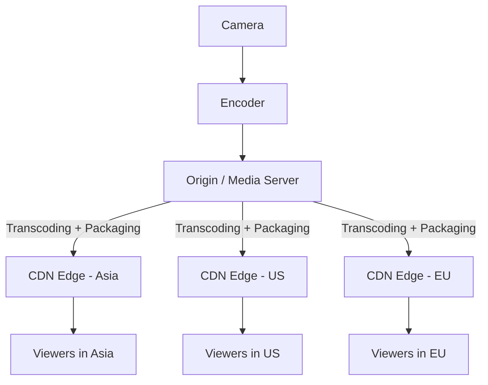

# 📺 CDN in Live Streaming

## 🔹 How It Works
1. **Live Source / Encoder**
   - Camera captures raw video.
   - Encoder (e.g., OBS, FFmpeg, Wowza) compresses into streamable formats (H.264/H.265 video, AAC audio).

2. **Ingest to Origin Server**
   - Stream pushed via **RTMP, SRT** to origin/media server (e.g., Wowza, AWS MediaLive).
   - Origin transcodes into multiple bitrates for **Adaptive Bitrate Streaming (ABR)**.

3. **Segmentation and Packaging**
   - Origin converts live stream into small segments (2–10s).
   - Packaged into **HLS (m3u8)** or **MPEG-DASH (mpd)** playlists.

4. **CDN Distribution**
   - CDN caches video segments and distributes via **edge servers** globally.
   - User requests are routed to nearest edge for minimal latency.

5. **End User Playback**
   - Player fetches `.m3u8` (HLS) or `.mpd` (DASH).
   - Segments streamed sequentially for continuous playback.
   - ABR ensures quality adjusts to user’s network speed.

---

## 🔹 Architecture



## 🔹 Request Flow for Live Streaming
```
sequenceDiagram
    participant P as Player (User)
    participant CE as CDN Edge Server
    participant O as Origin/Media Server

    P->>CE: Request playlist (index.m3u8)
    CE->>O: If not cached, fetch index.m3u8
    O-->>CE: Return playlist
    CE-->>P: Deliver playlist

    P->>CE: Request segment (segment1.ts)
    CE->>O: If not cached, fetch segment1.ts
    O-->>CE: Return segment1.ts
    CE-->>P: Deliver segment1.ts

    Note over P,CE: Subsequent segments served from edge cache<br/>until TTL expiry or invalidation
```

## 🔹 Key Features of CDN in Live Streaming
    - Low Latency Delivery → Edge servers reduce delays.
    - Scalability → Millions of concurrent viewers supported.
    - Adaptive Bitrate Streaming (ABR) → Adjusts resolution based on user’s bandwidth.
    - Redundancy & Reliability → Failover between edges.
    - Security → DRM, token authentication, geo-blocking.