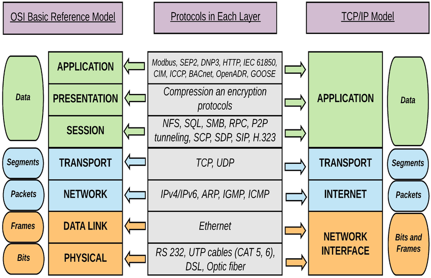
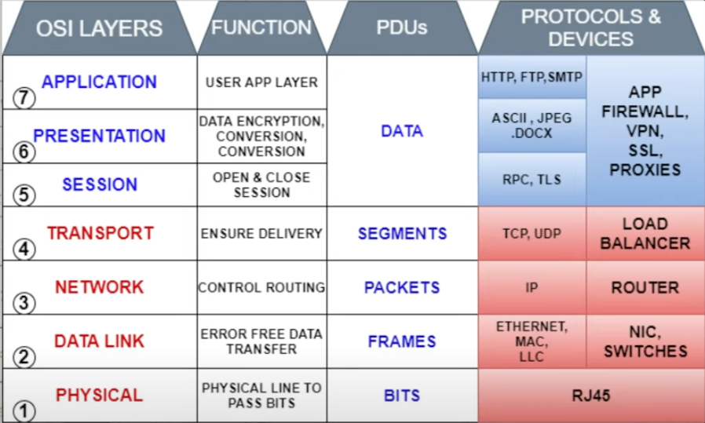

# TCP/IP and OSI Models with Examples

## 🌐 TCP/IP Model (4 Layers)
1. **Application Layer**
   - What it does: User applications (communication, file transfer, browsing).
   - Examples: HTTP (web), SMTP (email), FTP (file transfer), DNS.

2. **Transport Layer**
   - What it does: End-to-end communication, reliability, segmentation.
   - Examples: TCP (reliable, connection-oriented), UDP (faster, connectionless).

3. **Internet Layer**
   - What it does: Logical addressing, routing.
   - Examples: IP (IPv4/IPv6), ICMP (ping), ARP (address resolution).

4. **Network Access Layer (Link Layer)**
   - What it does: Physical transmission, MAC addressing.
   - Examples: Ethernet, Wi-Fi, PPP, Frame Relay.

---

## 📶 OSI Model (7 Layers)
1. **Application Layer**
   - End-user services.
   - Examples: HTTP, SMTP, FTP, DNS.

2. **Presentation Layer**
   - Data format, encryption, compression.
   - Examples: JPEG, MP3, SSL/TLS, GIF.

3. **Session Layer**
   - Manages sessions between applications.
   - Examples: NetBIOS, RPC, PPTP.

4. **Transport Layer**
   - Reliable delivery, flow control.
   - Examples: TCP, UDP.

5. **Network Layer**
   - Routing, logical addressing.
   - Examples: IP, ICMP, OSPF, RIP.

6. **Data Link Layer**
   - Framing, MAC addressing, error detection.
   - Examples: Ethernet, PPP, Switches.

7. **Physical Layer**
   - Transmission of raw bits over media.
   - Examples: Cables, Hubs, Fiber optics, NICs.

---

## 🔄 Quick Mapping (OSI → TCP/IP)
- **Application (7,6,5 in OSI)** → **Application (TCP/IP)**
- **Transport (4 in OSI)** → **Transport (TCP/IP)**
- **Network (3 in OSI)** → **Internet (TCP/IP)**
- **Data Link + Physical (2 & 1 in OSI)** → **Network Access (TCP/IP)**

---

## 👉 In short
- **OSI = 7 layers (theory, detailed)**
- **TCP/IP = 4 layers (practical, used on the Internet)**

## 👉 Diagram

---
# OSI Model (7 Layers of Networking)

## Layer 1 – Physical Layer

**Role:** Deals with raw transmission of bits (0s and 1s) over the physical medium.
**Function:** Defines cables, connectors, voltage, frequency, and transmission rates.
**Devices:** Hubs, repeaters, network cables (Ethernet, fiber optic).
**Example:**

* Sending an electrical signal over an Ethernet cable.
* Fiber optics converting light pulses to represent binary data.

---

## Layer 2 – Data Link Layer

**Role:** Provides node-to-node data transfer and error detection.
**Function:** Frames the data, uses MAC addresses, and ensures reliable delivery within the same network (LAN).
**Sub-layers:**

* **LLC (Logical Link Control):** Manages error checking and flow control.
* **MAC (Media Access Control):** Provides hardware addressing (MAC address).
  **Devices:** Switches, Bridges.
  **Protocols:** Ethernet (IEEE 802.3), Wi-Fi (802.11), PPP.
  **Example:**
* A switch forwarding frames using MAC addresses.
* Your laptop connecting to Wi-Fi using its MAC.

---

## Layer 3 – Network Layer

**Role:** Responsible for logical addressing and routing between different networks.
**Function:** Provides IP addressing, decides best path using routing protocols.
**Devices:** Routers, Layer 3 Switches.
**Protocols:** IPv4, IPv6, ICMP, OSPF, BGP.
**Example:**

* A router forwarding packets between two subnets.
* Ping using ICMP to test connectivity.

---

## Layer 4 – Transport Layer

**Role:** Ensures complete data transfer between applications.
**Function:** Provides segmentation, reliability, error recovery, and flow control.
**Protocols:**

* **TCP (Transmission Control Protocol):** Reliable, connection-oriented.
* **UDP (User Datagram Protocol):** Faster, connectionless, no guarantee.
  **Example:**
* TCP used for file downloads, emails.
* UDP used for video streaming, gaming.

---

## Layer 5 – Session Layer

**Role:** Manages sessions (start, maintain, terminate communication).
**Function:** Keeps track of connections, dialog control, synchronization.
**Example:**

* Logging into a remote server (SSH, RDP).
* Keeping your online banking session active until logout.

---

## Layer 6 – Presentation Layer

**Role:** Responsible for data translation, encryption, and compression.
**Function:** Makes data readable to applications by converting into a standard format.
**Examples:**

* Encryption/Decryption (SSL/TLS for HTTPS).
* JPEG, MP3, MPEG formatting.
* ASCII, EBCDIC text encoding.

---

## Layer 7 – Application Layer

**Role:** Closest to the end-user; provides network services to applications.
**Function:** Defines application protocols and user interaction.
**Protocols:** HTTP, HTTPS, FTP, SMTP, DNS, SNMP.
**Examples:**

* Web browsing (HTTP/HTTPS).
* Sending an email (SMTP).
* File transfer (FTP, SFTP).

---

## Quick Summary

* **Layer 1 (Physical):** Cables, signals.
* **Layer 2 (Data Link):** MAC addresses, frames, switches.
* **Layer 3 (Network):** IP addresses, routing, routers.
* **Layer 4 (Transport):** TCP/UDP, reliability.
* **Layer 5 (Session):** Session management.
* **Layer 6 (Presentation):** Data formatting, encryption.
* **Layer 7 (Application):** End-user services (HTTP, FTP, DNS).
